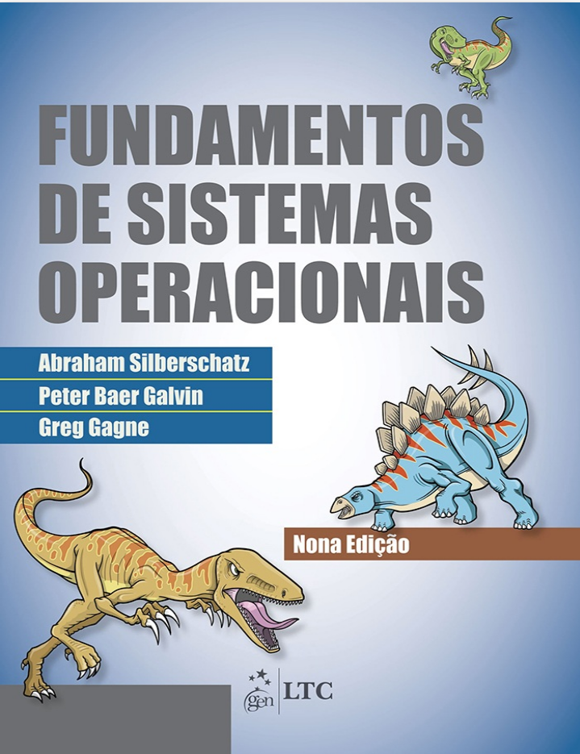
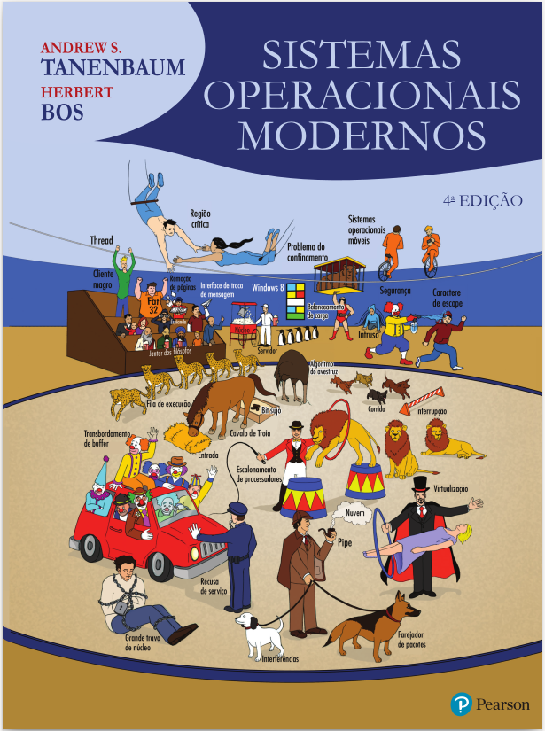

# -*- coding: utf-8 -*-
# -*- mode: org -*-
#+startup: beamer overview indent
#+LANGUAGE: pt-br
#+TAGS: noexport(n)
#+EXPORT_EXCLUDE_TAGS: noexport
#+EXPORT_SELECT_TAGS: export

#+Title: Sistemas Operacionais
#+Subtitle: *INF01142*
#+Author: Prof. Lucas Mello Schnorr
#+Date: \copyleft

#+LaTeX_CLASS: beamer
#+LaTeX_CLASS_OPTIONS: [xcolor=dvipsnames,10pt]
#+OPTIONS: H:1 num:t toc:nil \n:nil @:t ::t |:t ^:t -:t f:t *:t <:t
#+LATEX_HEADER: \input{org-babel.tex}

* O professor

Prof. Lucas M. Schnorr -- schnorr@inf.ufrgs.br

* Funcionamento das aulas

As aulas são majoritariamente expositivas, com discussão.

A presença será aferida (75% de frequência evita FF)
- São 30 encontros no total, portanto 8 faltas implica em FF

#+latex: \vfill

Perguntar sempre em caso de dúvida
- seja ator do teu aprendizado

* Abono de frequência por razões de saúde

#+latex: \scalebox{0.9}{\vbox{
Recuperação de frequência ou atividades avaliativas por licença médica.

Os casos de licença médica do aluno ou para atendimento de familiar
que afetem atividades avaliativas devem ser encaminhados ao
Departamento de Atenção a Saúde da UFRGS seguindo orientações deste
link: https://www.ufrgs.br/das/pericia-oficial-em-saude-alunos/

Para solicitar a Licença para Tratamento de Saúde, o aluno deve
encaminhar a documentação médica (atestado original ou cópia
autenticada com o CID -- Codigo Internacional de Doenças) para o
e-mail: atestadosalunos@ufrgs.br e solicitar avaliação. O documento
será analisado e os atestados médicos/odontológicos que solicitarem
até cinco dias corridos de afastamento (computados fins de semana e
feriados) poderão ser registrados com dispensa de perícia.

No corpo do e-mail em que foi enviado o atestado, devem constar
informados os seguintes dados: nome completo, número do cartão UFRGS,
curso, telefone para contato.

Caso haja necessidade de agendamento de perícia, você será informado,
através do seu e-mail, da data e do horário de comparecimento ao
Departamento de Atenção à Saúde para a realização do exame pericial. O
DAS envia ao professor o período do afastamento, sem compartilhar
nenhuma informação pessoal do estudante.

IMPORTANTE: Aulas abonadas não constam como presença; O estudante deve
combinar com o professor a recuperação das atividades avaliativas.
#+latex: }}

* Plano, cronograma, bibliografia, projeto

+ Súmula, conteúdo programático, bibliografia e cronograma
+ Procedimentos didáticos, laboratórios
+ Trabalhos, provas e avaliação

#+begin_center
Consulte no Portal do Aluno da UFRGS, ou uma cópia no moodle
#+end_center

#+latex: \vfill

Vamos revisar os pontos juntos!

* Bibliografia

** Left                                                              :BMCOL:
:PROPERTIES:
:BEAMER_col: 0.5
:END:
- SILBERSCHATZ, Abraham; GALVIN, Peter Baer; GAGNE, Greg. Fundamentos de sistemas operacionais. 9. ed. Rio de Janeiro: LTC, 2019. ISBN 978-85-216-2939-9.
#+attr_latex: :width .7\linewidth

** Right                                                             :BMCOL:
:PROPERTIES:
:BEAMER_col: 0.5
:END:
- TANENBAUM, Andrew S.; BOS, Herbert. Sistemas operacionais modernos. 4. ed. São Paulo: Pearson, 2016. ISBN 978-85-430-0340-2.
#+attr_latex: :width .7\linewidth

* Avaliação

A avaliação será feita da seguinte forma:
- Duas provas escritas (P1, P2)
- Conjunto de trabalhos em laboratório

#+latex: \pause

Média Final (MF) = (P1+P2+T)/3

#+latex: \pause

Conversão

| MF >= 9,0       | Conceito A                    |
| 9.0 > MF >= 7,5 | Conceito B                    |
| 7,5 > MF >= 6,0 | Conceito C                    |
| MF < 6,0        | ver Atividades de Recuperação |

Presença
- A presença será aferida (75% de frequência evita FF)
  
* Recuperação

Os alunos que não alcançarem nota para aprovação (NF >= 6,0) poderão
realizar uma atividade avaliativa de recuperação, que versará sobre
qualquer dos conteúdos apresentados na disciplina.

* Acompanhamento

#+BEGIN_CENTER
Aulas.

Moodle da UFRGS
#+END_CENTER

#+latex: \vfill

Em dúvidas
- Seja ator do teu aprendizado
- Discuta com os colegas
- Converse com os professores

* Cronograma

_Cronograma_

#+latex: \bigskip

Verifique Moodle

#+latex: \bigskip

Vamos revisá-lo juntos.
