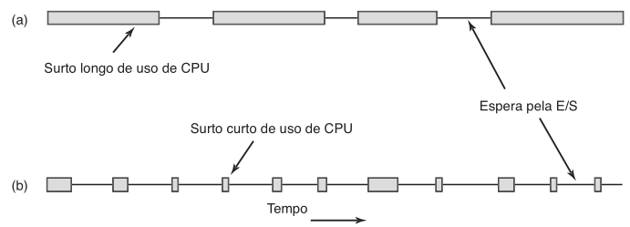

# -*- coding: utf-8 -*-
# -*- mode: org -*-
#+startup: beamer overview indent
#+LANGUAGE: pt-br
#+TAGS: noexport(n)
#+EXPORT_EXCLUDE_TAGS: noexport
#+EXPORT_SELECT_TAGS: export

#+Title: Sistemas Operacionais
#+Subtitle: *Escalonamento de CPU I*
#+Author: Prof. Lucas Mello Schnorr (UFRGS)
#+Date: \copyleft

#+LaTeX_CLASS: beamer
#+LaTeX_CLASS_OPTIONS: [xcolor=dvipsnames,10pt]
#+OPTIONS: H:1 num:t toc:nil \n:nil @:t ::t |:t ^:t -:t f:t *:t <:t
#+LATEX_HEADER: \input{org-babel.tex}

* Código                                                           :noexport:
** Tema
#+begin_src R :results output :session *R* :exports both :noweb yes :colnames yes
options(crayon.enabled=FALSE)
suppressMessages(library(tidyverse))
list(
  scale_fill_brewer(palette = "Set1"),  
  theme_bw(base_size = 14),
  theme(
    plot.margin = unit(c(0, 0, 0, 0), "cm"),
    legend.spacing = unit(1, "mm"),
    panel.grid = element_blank(),
    legend.position = "none",
    legend.justification = "left",
    legend.box.spacing = unit(0, "pt"),
    legend.box.margin = margin(0, 0, 0, 0),
    axis.text.y  = element_blank(),
    axis.ticks.y = element_blank(),
    axis.title.y = element_blank(),
    axis.line.y  = element_blank(),
    axis.title.x = element_blank(),    
  ),
  scale_x_continuous(expand = c(0, 0)),
  scale_y_continuous(expand = c(0, 0))  
) -> my.theme
#+end_src

#+RESULTS:
** Função

#+begin_src R :results output :session *R* :exports both :noweb yes :colnames yes
plot_schedule <- function(df, base_size = 14) {
  df |>
    mutate(name2 = paste0(name, "=", tempo)) |>
    mutate(
      inicio = cumsum(tempo) - tempo,
      fim = inicio + tempo,
      center = inicio + (fim - inicio)/2
    ) -> df
  df |>
    ggplot(aes(
      fill = name,
      label = name2,
      x = center, y = 0.5,
      xmin = inicio, xmax = fim,
      ymin = 0, ymax = 1
    )) +
    geom_rect() +
    geom_text(size = base_size/2) +
    my.theme +
    scale_x_continuous(
      breaks = df$inicio,
      labels = df$inicio,
      expand = c(0,0)
    )
}
#+end_src

#+RESULTS:

* Estrutura da aula

- Revisão da aula anterior (IPC \to Pipes)
  - O que acontece se eu acessar o =ptr= depois do =shm_unlink=?
  - Como fazer dois processos filhos se comunicarem?
- Conceitos de escalonamento
- Critérios (utilização, throughput, turnaround, tempo de espera)
- Algoritmos não-preemptivos: FIFO/FCFS, SJF

* Revisão: =shm_unlink= e acesso posterior ao ponteiro
** Produtor                                                        :BMCOL:
:PROPERTIES:
   :BEAMER_col: 0.5
   :END:

#+BEGIN_SRC C :tangle shm-exemplo-produtor.c
#include <stdio.h>
#include <string.h>
#include <fcntl.h>
#include <sys/mman.h>
#include <unistd.h>
int main() {
  const int SIZE = 4096;
  const char *name = "OS";
  const char *msg0 = "Hello";
  const char *msg1 = "World!";
  int shm_fd;
  void *ptr;
  shm_fd = shm_open(name,
    O_CREAT | O_RDWR, 0666);
  ftruncate(shm_fd, SIZE);
  ptr = mmap(0, SIZE,
    PROT_WRITE, MAP_SHARED,
    shm_fd, 0);
  sprintf(ptr, "%s", msg0);
  ptr += strlen(msg0);
  sprintf(ptr, "%s", msg1);
  return 0;
}
#+END_SRC

** Consumidor                                                      :BMCOL:
:PROPERTIES:
   :BEAMER_col: 0.5
   :END:

#+BEGIN_SRC C :tangle shm-exemplo-consumidor.c
#include <stdio.h>
#include <fcntl.h>
#include <sys/mman.h>
#include <unistd.h>
int main() {
  const int SIZE = 4096;
  const char *name = "OS";
  int shm_fd;
  void *ptr;
  shm_fd = shm_open(name,
    O_RDONLY, 0666);
  ptr = mmap(0, SIZE,
    PROT_READ, MAP_SHARED,
    shm_fd, 0);
  /* remove o objeto ANTES de ler */
  shm_unlink(name);
  /* ptr ainda acessível? Sim, ver "man mmap". */
  printf("%s", (char *)ptr);
  return 0;
}
#+END_SRC

* Revisão: Dois processos filhos comunicando via pipe

#+BEGIN_SRC C :tangle pipe-exemplo-dois-filhos.c
#include <sys/types.h>
#include <sys/wait.h>
#include <stdio.h>
#include <string.h>
#include <unistd.h>
#define BUFFER_SIZE 25
#define READ_END  0
#define WRITE_END 1
int main(void) {
  char write_msg[BUFFER_SIZE] = "Olá do filho 1";
  char read_msg[BUFFER_SIZE];
  int fd[2];
  pid_t pid;
  pipe(fd);                            /* cria o pipe antes dos forks */
  pid = fork();                        /* cria filho 1 (enviador) */
  if (pid == 0) {
    close(fd[READ_END]);
    write(fd[WRITE_END], write_msg, strlen(write_msg)+1);
    close(fd[WRITE_END]);
    return 0;
  }
  pid = fork();                        /* cria filho 2 (receptor) */
  if (pid == 0) {
    close(fd[WRITE_END]);
    read(fd[READ_END], read_msg, BUFFER_SIZE);
    printf("filho 2 recebeu: %s\n", read_msg);
    close(fd[READ_END]);
    return 0;
  }
  close(fd[READ_END]);                 /* pai fecha ambas as extremidades */
  close(fd[WRITE_END]);
  wait(NULL); wait(NULL);
  return 0;
}
#+END_SRC

* Escalonamento: Motivação

Em sistemas multiprogramados, múltiplos processos competem pela CPU

- Sempre que dois ou mais processos estão no estado pronto
  - É preciso escolher qual processo será executado em seguida
- O _escalonador_ é a parte do SO que faz essa escolha
- O _algoritmo de escalonamento_ é o critério usado pelo escalonador

#+latex: \vfill\pause

- Em computadores pessoais: geralmente um processo ativo, CPU sobra
- Em servidores em rede: múltiplos processos disputam a CPU continuamente
- Em dispositivos móveis: duração da bateria impõe restrições adicionais

* Introdução ao Escalonamento

Trocar de processo (contexto) é uma operação cara

- Mudança do modo usuário para o modo núcleo
- Salvar o estado do processo atual na tabela de processos
- Salvar o mapa de memória (tabela de páginas, bits de referência)
- Executar o algoritmo de escalonamento para escolher o próximo processo
- Recarregar a MMU com o mapa de memória do novo processo
- Recarregar o cache de memória (invalidado pela troca)

#+latex: \vfill

- Muitas trocas por segundo consomem tempo substancial de CPU
- Um bom escalonador minimiza trocas desnecessárias

* Comportamento dos processos

Quase todos os processos alternam _surtos de CPU_ com _esperas de E/S_

- Processos _limitados pela CPU_: longos surtos de CPU (E/S esporádicas)
- Processos _limitados pela E/S_: curtos surtos de CPU (E/S frequentes)

#+attr_latex: :width .6\linewidth

#+latex: \vfill\pause

Com CPUs mais rápidas, processos tendem a ser mais limitados pela E/S
- /Limitados E/S/ \to devem receber a CPU rapidamente
- Precisamos de vários /Limitados E/S/ para manter a CPU ocupada

* Reflexão: velocidade da CPU e E/S                                :noexport:

CPUs melhoram muito mais rápido do que discos

- Processos limitados pela E/S tornam-se mais comuns ao longo do tempo
- Escalonar processos limitados pela E/S rapidamente mantém o disco ocupado
- Manter o disco ocupado é essencial para alto desempenho do sistema

#+latex: \vfill

- Se processo limitado pela E/S aguarda muito, o disco fica ocioso
- Mesclar processos limitados pela CPU e pela E/S otimiza o uso de todos os recursos

* Quando Tomar Decisões de Escalonamento

#+attr_latex: :width .5\linewidth
[[./S_fig3.2.png]]

1. Quando um processo passa do estado de execução para o estado de espera
   - Fez E/S ou fez =wait= no processo filho
2. Quando um processo passa do estado de execução para o estado de pronto
   - Interrupção de tempo
3. Quando um processo passa do estado de espera para o estado de pronto
   - Requisição de E/S terminou
4. Quando um processo termina

#+latex: \vfill\pause

** A _decisão de escalonamento_ é tomada
- Somente nas situações 1 e 4
  - Escalonamento sem preempção (chamado também de cooperativo)
- Também nas situações 2 e 3
  - Escalonamento com preempção

* Escalonamento Com e Sem Preempção

Algoritmo _sem preempção_ (cooperativo)

- Escolhe um processo, este executa até bloquear ou terminar
- Nenhuma decisão de escalonamento durante interrupções de relógio
- Simples de implementar; não requer hardware especial (timer)

#+latex: \vfill

Algoritmo _com preempção_

- Escolhe um processo, o executa por no máximo um intervalo de tempo
- Ao fim do intervalo: processo suspenso e novo processo escolhido
- Requer interrupção de relógio periódica
- Pode causar condições de corrida em dados compartilhados

* Objetivos dos Algoritmos de Escalonamento

Todos os sistemas

- Justiça: dar a cada processo uma porção justa da CPU
- Aplicação da política: garantir que a política estabelecida seja cumprida
- Equilíbrio: manter todas as partes do sistema ocupadas

#+latex: \vfill

Sistemas em lote

- Alta vazão (throughput): o número de tarefas concluídas por hora
- Menor tempo de retorno (turnaround): tempo entre submissão e término
- Alta utilização de CPU

#+latex: \vfill

Sistemas interativos e de tempo real

- Tempo de resposta: responder rapidamente às requisições
- Previsibilidade: evitar degradação da qualidade (ex.: multimídia)

* Métricas para Avaliar Algoritmos de Escalonamento

- _Utilização da CPU_: manter a CPU tão ocupada quanto possível (40–90%)
- _Vazão_: número de processos concluídos por unidade de tempo
- _Tempo de retorno_: intervalo entre submissão e conclusão do processo
  - Espera na fila de prontos + Exec. na CPU + Exec. de E/S
- _Tempo de espera_: soma dos períodos gastos aguardando na fila de prontos
- _Tempo de resposta_: tempo até a primeira resposta ser produzida

#+latex: \vfill\pause

- Afetados pela ordem de execução dos processos
  - Tempo de espera
  - Tempo de retorno

#+latex: \vfill\pause
    
- Em geral, procura-se
  - Maximizar ``Utilização da CPU''
  - Maximizar ``Vazão''
  - Minimizar os demais

* Algoritmos de Escalonamento

O escalonamento da CPU decide qual processo da fila de prontos recebe a CPU

#+latex: \vfill

Algoritmos que abordaremos

- Primeiro a Chegar, Primeiro a Ser Atendido (FCFS)
- Menor Job Primeiro (SJF)
- Escalonamento por Prioridades
- Round-Robin
- Filas Multiníveis
- Filas Multiníveis com Retroalimentação

#+latex: \vfill

- Nesta aula: algoritmos não-preemptivos
  - FCFS
  - SJF

* FCFS: Primeiro a Chegar, Primeiro a Ser Atendido

Algoritmo mais simples: processos recebem a CPU na ordem em que a solicitam

- Implementado com uma fila FIFO de PCBs
- Quando a CPU fica livre, o processo na cabeça da fila é executado
- Processo bloqueado vai para o fim da fila ao desbloquear

#+latex: \vfill

Exemplos: processos P1, P2, P3 com surtos de 24, 3, 3 ms (chegam em t=0)

- Ordem P1, P2, P3: espera de 0, 24, 27 ms \to média = 17 ms
#+begin_src R :results file output graphics :file (org-babel-temp-file "figure" ".png") :exports results :width 600 :height 40 :session *R* :center nil  
tribble(~name, ~tempo, ~chegada,
        "P1", 24, 0,
        "P2", 3, 0,
        "P3", 3, 0) |>
  plot_schedule()
#+end_src

#+RESULTS:
[[file:/tmp/babel-XEz44B/figureo5bT5j.png]]

- Ordem P2, P3, P1: espera de 0, 3, 6 ms \to média = 3 ms
#+begin_src R :results file output graphics :file (org-babel-temp-file "figure" ".png") :exports results :width 600 :height 40 :session *R* :center nil  
tribble(~name, ~tempo, ~chegada,
        "P2", 3, 0,
        "P3", 3, 0,
        "P1", 24, 0) |>
  plot_schedule()
#+end_src

#+RESULTS:
[[file:/tmp/babel-XEz44B/figureZzOeVs.png]]

#+latex: \vfill

** Tempo médio de espera varia muito conforme a ordem de chegada
- Vantagem: simples de compreender e implementar

* FCFS: Efeito Comboio

** Monopólio do uso da CPU por um processo

Um processo usa a CPU por 1s ...
- Enquanto ele usa a CPU
  - Todos os processos de E/S aguardam na fila de prontos
- ... e daí lê um bloco de disco
  - Os outros processos de E/S executam em rápida sucessão

** Problema: Ociosidade dos dispositivos de E/S

#+latex: \vfill

- Algoritmo inadequado para sistemas de tempo compartilhado
  - Processos de E/S se agrupam em ``comboio'' conforme avançam
- A solução seria preemptar o processo que monopoliza a CPU
  - Mas daí estamos vendo algoritmos com preempção (próxima aula)

* SJF: Menor Job Primeiro

Associa a cada processo a duração estimada do próximo surto de CPU

- CPU alocada ao processo com o próximo surto de CPU mais curto
- Em caso de empate, usa FCFS para desempatar

#+latex: \vfill\pause

Exemplo: P1=6, P2=8, P3=7, P4=3 ms (chegam em t=0)

- Ordem SJF: P4, P1, P3, P2
  - Espera: P1=3, P2=16, P3=9, P4=0 ms \to média = 7 ms

#+begin_src R :results file output graphics :file (org-babel-temp-file "figure" ".png") :exports results :width 600 :height 40 :session *R* :center nil
tribble(~name, ~tempo, ~chegada,
        "P1", 6, 0,
        "P2", 8, 0,
        "P3", 7, 0,
        "P4", 3, 0) |>
  arrange(tempo) |> # SJF
  plot_schedule()
#+end_src

#+RESULTS:
[[file:/tmp/babel-XEz44B/figurevZNAwC.png]]

#+latex: \pause

- Uma ordem com FCFS: P1, P2, P3, P4 (para comparação)
  - Espera: P1=0, P2=6, P3=14, P4=21 \to média = 10,25 ms

#+begin_src R :results file output graphics :file (org-babel-temp-file "figure" ".png") :exports results :width 600 :height 40 :session *R* :center nil
tribble(~name, ~tempo, ~chegada,
        "P1", 6, 0,
        "P2", 8, 0,
        "P3", 7, 0,
        "P4", 3, 0) |>
  plot_schedule()
#+end_src

#+RESULTS:
[[file:/tmp/babel-XEz44B/figure75mX7j.png]]

#+latex: \vfill\pause

** SJF é ótimo para tempo médio de espera mínimo
- Executar sempre um processo curto antes de um longo

  #+begin_center
  Reduz mais o tempo de espera do curto
  
  do que aumenta o tempo de espera do longo
  #+end_center  

* SJF: Limitações

É ótimo apenas quando todos os processos estão disponíveis simultaneamente

- Vejamos este contraexemplo
  - Tempos: A=2, B=4, C=1, D=1, E=1 ms
  - Chegadas: A,B em t=0; C,D,E em t=3
- Ordem SJF: A, B, C, D, E \to tempo de espera médio = 4,6 ms
#+begin_src R :results file output graphics :file (org-babel-temp-file "figure" ".png") :exports results :width 600 :height 40 :session *R* :center nil
tribble(~name, ~tempo, ~chegada,
        "A", 2, 0,
        "B", 4, 0,
        "C", 1, 3,
        "D", 1, 3,
        "E", 1, 3) |>
  plot_schedule()
#+end_src  

#+RESULTS:
[[file:/tmp/babel-XEz44B/figureqHEg91.png]]

#+latex: \pause

- Ordem alternativa: B, C, D, E, A \to tempo de espera médio = 4,4 ms
#+begin_src R :results file output graphics :file (org-babel-temp-file "figure" ".png") :exports results :width 600 :height 40 :session *R* :center nil
tribble(~name, ~tempo, ~chegada,
        "B", 4, 0,
        "C", 1, 3,
        "D", 1, 3,
        "E", 1, 3,
        "A", 2, 0) |>
  plot_schedule()
#+end_src

#+RESULTS:
[[file:/tmp/babel-XEz44B/figurevVPGDq.png]]

#+latex: \vfill\pause

** Grande dificuldade: como saber a duração do próximo uso de CPU?

- Em sistemas de lote: limite de tempo informado pelo usuário OK!
- Em escalonamento de curto prazo
  - Não há como saber o próximo surto com exatidão
- Solução: _estimar_ o próximo surto com base nos surtos anteriores

* SJF: Estimativa do Próximo Uso de CPU

O próximo surto é previsto como média exponencial dos surtos anteriores

- Seja $t_n$ a duração do n-ésimo uso de CPU medido
- Seja $\tau_{n}$ o valor da história passada
- Seja $\tau_{n+1}$ o valor previsto para o próximo surto
- Seja $\alpha$ o peso relativo da história passada e presente, com $0 \leq \alpha \leq 1$:

#+latex: \vfill

$$\tau_{n+1} = \alpha\, t_n + (1-\alpha)\, \tau_n$$

#+latex: \vfill

- $\alpha = 0$: $\tau_{n+1} = \tau_n$ — história recente ignorada, apenas histórico passado
- $\alpha = 1$: $\tau_{n+1} = t_n$ — apenas o surto mais recente importa
- $\alpha = 1/2$ (mais comum): histórico recente e passado têm peso igual
- $\tau_0$ inicial pode ser definido como constante ou média geral do sistema

** Left                                                              :BMCOL:
:PROPERTIES:
:BEAMER_col: 0.5
:END:

#+begin_src R :results file output graphics :file (org-babel-temp-file "figure" ".png") :exports results :width 320 :height 200 :session *R*
tau0 = 10
alpha = 0.5
tibble(tn = c(6, 4, 6, 4, 13, 13, 13)) |>
  mutate(ordem = row_number() - 1) |>
  mutate(
    tau = purrr::accumulate(
      tn,
      \(tau_prev, t) alpha * t + (1 - alpha) * tau_prev,
      .init = tau0
    )[-1]
  ) -> df

# gerar spline
spl <- with(df, spline(ordem, tau, n = 200)) |> as_tibble()

ggplot(df, aes(x = ordem)) +
  geom_col(aes(y = tn), width = 0.8, alpha = 0.6) +
  geom_line(data = spl, aes(x = x, y = y), linewidth = 1.2) +
  geom_point(aes(y = tau), size = 2) +
  labs(x = "ordem", y = "valor") +
#  my.theme +
  scale_x_continuous(
    breaks = seq(0, max(df$ordem), by = 1),
    expand = c(0,0)
  ) +
  scale_y_continuous(expand=c(0,0)) +
#  my.theme +
  labs(y = "Uso de CPU", x = "Tempo") +
  theme_bw(base_size=14) +
  theme(
    axis.text.y  = element_text(),
    axis.ticks.y = element_line(),
    axis.title.y = element_text(),
    axis.line.y  = element_line(),
    axis.title.x = element_text())
#+end_src

#+RESULTS:
[[file:/tmp/babel-XEz44B/figureb2SYBI.png]]

** Right
:PROPERTIES:
:BEAMER_col: 0.5
:END:

#+begin_src R :results table :session *R* :exports results :noweb yes :colnames yes
df
#+end_src

#+RESULTS:
| tn | ordem | tau |
|----+-------+-----|
|  6 |     0 |   8 |
|  4 |     1 |   6 |
|  6 |     2 |   6 |
|  4 |     3 |   5 |
| 13 |     4 |   9 |
| 13 |     5 |  11 |
| 13 |     6 |  12 |

* Referências

- Silberschatz, Galvin & Gagne — _Fundamentos de Sistemas Operacionais_, 9ª ed.
  - Cap. 6, Seções 6.1, 6.2, 6.3
- Tanenbaum & Bos — _Sistemas Operacionais Modernos_
  - Cap. 2, Seções 2.4.1, 2.4.2
