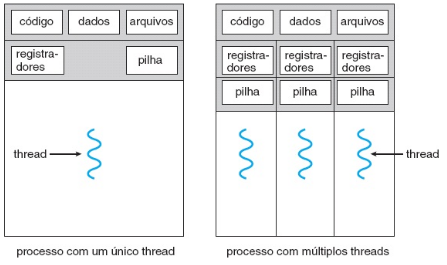
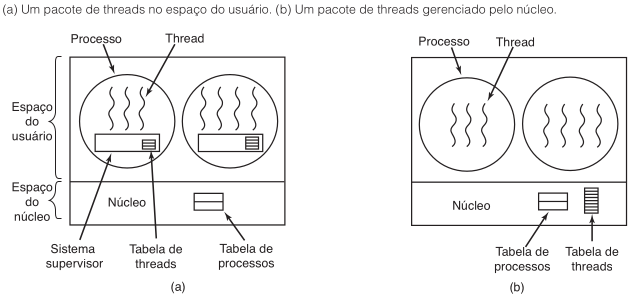

# -*- coding: utf-8 -*-
# -*- mode: org -*-
#+startup: beamer overview indent
#+LANGUAGE: pt-br
#+TAGS: noexport(n)
#+EXPORT_EXCLUDE_TAGS: noexport
#+EXPORT_SELECT_TAGS: export

#+Title: Sistemas Operacionais
#+Subtitle: Threads: Conceito e Modelos
#+Author: Prof. Lucas Mello Schnorr (UFRGS)
#+Date: \copyleft

#+LaTeX_CLASS: beamer
#+LaTeX_CLASS_OPTIONS: [xcolor=dvipsnames,10pt]
#+OPTIONS: H:1 num:t toc:nil \n:nil @:t ::t |:t ^:t -:t f:t *:t <:t
#+LATEX_HEADER: \input{org-babel.tex}

* Estrutura da aula

- Threads
  - Visão Geral
  - Programação Multicore
  - Modelos de Geração de Multithreads
- POSIX Threads

* Motivação

A maioria das aplicações modernas executa múltiplas tarefas simultâneas

- Navegador web: uma thread exibe conteúdo, outra busca dados na rede
- Processador de texto: uma thread interage com o usuário, outra reformata
- Servidores web: atendem milhares de clientes concorrentemente

#+latex: \vfill\pause

Criar uma thread por requisição é mais eficiente do que criar um processo

- Criação de processos é demorada e consome muitos recursos
- Uma thread separada é criada para cada req.; o servidor volta a esperar
- Kernels de SO também são multithreaded (geren. de dispositivos, memória)

* Visão Geral

** Uma thread é a unidade básica de utilização da CPU

- Composta por: identificador, contador de programa, registradores e pilha
- Threads do mesmo processo compartilham: código, dados e recursos do SO
- Um processo com múltiplas threads
  - Executa mais de uma tarefa (atividade, ou função) ao mesmo tempo

#+latex: \vfill\pause

** Cada thread tem sua própria pilha de execução

- Contém as variáveis locais e o endereço de retorno de cada função ativa
- Threads diferentes chamam rotinas diferentes e têm históricos distintos
- Não há nenhuma proteção entre threads do mesmo processo
  - Assume-se que elas cooperam evitando conflito

** Normal                                                  :B_ignoreheading:
:PROPERTIES:
:BEAMER_env: ignoreheading
:END:

#+attr_latex: :width .4\linewidth

* Benefícios

Quatro categorias principais de benefícios do uso de múltiplas threads:

#+latex: \vfill

1. Capacidade de resposta
   - Aplicação continua executando mesmo que parte esteja bloqueada
2. Compartilhamento de recursos
   - Threads compartilham memória e recursos do processo por padrão
3. Economia
   - Criar e alternar threads é significativamente mais barato do que processos
   - No Solaris: criação de processo é \approx30× mais lenta; troca de contexto \approx5×
     - Em relação ao mesmo com threads
4. Escalabilidade
   - Em sistemas multicore, threads executam em paralelo em núcleos distintos

* Programação Multicore

Sistemas modernos inserem múltiplos núcleos de computação no mesmo chip

- Cada núcleo aparece como um processador separado para o SO
- Multithreading permite uso mais eficiente dos múltiplos núcleos

#+latex: \vfill

** Concorrência versus paralelismo

- Sist. com um único núcleo: threads se intercalam no tempo (concorrência)
- Sist. com muitos núcleos: threads executam simultaneamente (paralelismo)

#+latex: \vfill\pause

** CPUs modernas suportam múltiplas threads por núcleo em hardware

- Intel: tipicamente 2 threads por núcleo (/hyperthreading/)
- Oracle T4: 8 threads por núcleo

* Desafios da Programação Multicore

Cinco áreas de desafio para programação em sistemas multicore:

#+latex: \vfill

1. Identificação de tarefas
   - Dividir a aplicação em tarefas independentes executáveis em paralelo
2. Equilíbrio
   - Garantir que cada tarefa realize esforço de valor semelhante
3. Divisão de dados
   - Dividir os dados para que cada núcleo possa trabalhar sem conflito
4. Dependência de dados
   - Sincronizar tarefas quando uma depende dos dados de outra
5. Teste e depuração
   - Múltiplos caminhos de execução tornam o teste muito mais complexo

* Lei de Amdahl

Identifica o ganho máximo de desempenho ao adicionar núcleos de computação

#+latex: \vfill

Se =S= é a fração serial da aplicação e =N= é o número de núcleos:

#+begin_center
Aceleração <= 1 / ( S + (1 - S) / N )
#+end_center

#+latex: \vfill

Exemplo: aplicação com 75% paralelo e 25% serial

- Com 2 núcleos: aceleração de \approx1,6×
- Com 4 núcleos: aceleração de \approx2,28×

#+latex: \vfill\pause

** Conclusão: a parte serial limita o ganho de desempenho total

- Com 40% serial: aceleração máxima é 2,5×, independente dos núcleos
- Reduzir a fração serial é mais impactante do que adicionar núcleos
  - Eventualmente adotando outro algoritmo

* Tipos de Paralelismo

Dois tipos principais de paralelismo em sistemas multicore:

#+latex: \vfill

** Paralelismo de dados

- Distribui subconjuntos dos mesmos dados entre os núcleos
- Cada núcleo executa a mesma operação sobre seu subconjunto
- Exemplo: somar array de tamanho N dividindo pela metade entre 2 núcleos

#+latex: \vfill \pause

** Paralelismo de tarefas

- Distribui tarefas (threads) distintas entre os núcleos
- Cada thread executa uma operação diferente (sobre os mesmos dados)
- Exemplo: 2 threads calculam estatísticas diferentes sobre o mesmo array

#+latex: \vspace{1cm}\pause

** Normal                                                  :B_ignoreheading:
:PROPERTIES:
:BEAMER_env: ignoreheading
:END:
#+begin_center
Na prática, a maioria das aplicações usa _uma combinação dos dois tipos_
#+end_center

* Modelos de Geração de Multithreads

O suporte às threads pode ser fornecido no nível do usuário ou do kernel

- Threads de usuário: gerenciadas sem suporte do kernel (biblioteca)
- Threads de kernel: gerenciadas diretamente pelo SO

#+attr_latex: :width .6\linewidth

  
#+latex: \vfill\pause

** Três modelos de relacionamento entre threads de usuário e de kernel:

- Muitos-Para-Um (threads em nível de usuário)
  - Várias threads de usuário mapeados para uma única thread de kernel
- Um-Para-Um (threads em nível de núcleo)
  - Cada thread de usuário mapeado para uma thread de kernel
- Muitos-Para-Muitos (implementações híbridas)
  - Multiplexa muitas thr. de usuário para um número <= de thrs. de kernel

* Modelo Muitos-Para-Um

Muitas threads de nível de usuário mapeados para uma única thread de kernel

- Gerenciamento feito inteiramente pela biblioteca no espaço do usuário
- Troca de contexto muito rápida
  - Sem chamada ao kernel
  - Sem esvaziamento de cache
- Exemplos de uso
  - Green Threads (Solaris)
  - Versões iniciais de Java

#+latex: \vfill\pause

** Limitações importantes

- Uma chamada de sistema bloqueante bloqueia o processo inteiro
- Falta de página em um thread bloqueia todas as demais
- Apenas uma thread acessa o kernel por vez
  - Sem paralelismo real em multicore

* Problemas do Modelo Muitos-Para-Um

Chamadas de sistema bloqueantes são o principal problema

- Se uma thread bloquear, todas as threads do processo ficam parados
- Solução parcial: =select= para verificar antes se uma =read= bloqueará
  - Exige reescrita da biblioteca de chamadas; ineficiente e deselegante

#+latex: \vfill\pause

Faltas de página bloqueiam o processo inteiro

- SO não conhece as threads internas; bloqueia o processo ao buscar página

#+latex: \vfill\pause

Ausência de preempção interna

- Sem interrupção de relógio, threads não podem ser preemptadas
- Uma thread que não cede a CPU voluntariamente impede as demais
- Solução: chamar =thread_yield= periodicamente (cooperativo)

#+latex: \vfill\pause

** Conclusão

- Muito pouco utilizado em razão da falta de suporte a multicore
  - Mas ... =<ucontext.h>= (em alguns casos é bem útil)

* Modelo Um-Para-Um

Cada thread de usuário é mapeada para uma thread de kernel

- SO gerencia todas as threads
  - Tabela de threads mantida no espaço do kernel
- Chamadas bloqueantes não bloqueiam as demais threads do processo
- Threads podem executar em paralelo em processadores multicore

#+latex: \vfill\pause

** Desvantagem principal: sobrecarga de criação

- Uma thread de usuário exige uma chamada de sistema para existir
- A maioria das implementações limita o número máximo de threads
  #+begin_src bash :results output :session *R* :exports both :noweb yes :colnames yes
  cat /proc/sys/kernel/threads-max # limite geral
  ulimit -u # limite para o usuário  
  cat /proc/sys/kernel/pid_max # cada thread tem um PID
  ps -eL | wc -l # quantas threads estou usando
  #+end_src
- Threads destruídas podem ser recicladas para evitar overhead de criação

#+latex: \vfill\pause

** Implementações

- Linux
- Outros SOs modernos

* Bibliotecas de Threads

Uma biblioteca (API) para criação e gerenciamento de threads

- Implem. em espaço de usuário: chamadas são funções locais (sem trap)
- Implem. em nível de kernel: chamadas resultam em chamadas de sistema

#+latex: \vfill\pause

** Principais bibliotecas utilizadas atualmente

1. POSIX threads: normalmente de kernel; usada em UNIX/Linux/macOS
2. Windows Threads: nível de kernel; disponível nos sistemas Windows

#+latex: \medskip

Outras usam a biblioteca do SO hospedeiro
- [Java|Python|.*] Threads
  - Pthreads no Linux, Win API no Windows

#+latex: \vfill\pause

** Dados compartilhados entre threads

- Variáveis globais são compartilhadas por todas as threads do processo
- Variáveis locais ficam na pilha; cada thread tem sua própria cópia

* Operações Básicas com Threads

Operações fundamentais disponíveis em pacotes de threads:

#+latex: \vfill

- =create=: cria uma nova thread no mesmo espaço de endereçamento
  - Retorna um identificador da thread criada
- =exit=: encerra a thread atual e libera sua pilha
- =join=: bloqueia a thread chamadora até que uma thread específica termine
  - Semelhante à espera pai/filho nos processos
- =yield=: a thread cede voluntariamente a CPU para outra ser executada
  - Importante no modelo de usuário, onde não há preempção automática

#+latex: \vfill

Portanto operações análogas à criação e término de processos

* Threads POSIX

O padrão Pthreads (IEEE 1003.1c) define uma API portável para threads

- É uma especificação de comportamento, não uma implementação
- Suportado por sistemas UNIX: Linux, macOS, Solaris e outros

#+latex: \vfill

** Principais chamadas da API Pthreads:

| Chamada               | Descrição                                         |
|-----------------------+---------------------------------------------------|
| =pthread_create=        | Cria uma nova thread                              |
| =pthread_exit=          | Encerra a thread chamadora                        |
| =pthread_join=          | Aguarda o término de uma thread específica        |
| =pthread_yield=         | Libera a CPU para outra thread ser executada      |
| =pthread_attr_init=     | Cria e inicializa uma estrutura de atributos      |
| =pthread_attr_destroy=  | Remove a estrutura de atributos de uma thread     |

* Exemplo: Pthreads com 1 thread

#+begin_src C :tangle aula07-pthread-1thread.c
#include <pthread.h>
#include <stdio.h>

int sum; /* dado compartilhado entre as threads */

void *runner(void *param); /* função executada pela thread */

int main(int argc, char *argv[]) {
  pthread_t tid;       /* identificador da thread */
  pthread_attr_t attr; /* atributos da thread */
  pthread_attr_init(&attr);
  pthread_create(&tid, &attr, runner, argv[1]);
  pthread_join(tid, NULL); /* aguarda a thread filha */
  printf("sum = %d\n", sum);
}

void *runner(void *param) {
  int i, upper = atoi(param);
  sum = 0;
  for (i = 1; i <= upper; i++)
    sum += i;
  pthread_exit(0);
}
#+end_src

* Exemplo: Pthreads com múltiplas threads

Para aguardar múltiplas threads, insere-se =pthread_join= em um laço:

#+begin_src C :tangle aula07-pthread-Nthread.c
#include <pthread.h>
#include <stdio.h>
#include <stdlib.h>

#define NUMBER_OF_THREADS 10

void *print_hello_world(void *tid) {
  printf("Ola mundo. Boas vindas da thread %ld\n", (long)tid);
  pthread_exit(NULL);
}

int main(int argc, char *argv[]) {
  pthread_t threads[NUMBER_OF_THREADS];
  int status, i;
  for (i = 0; i < NUMBER_OF_THREADS; i++) {
    printf("Main: criando thread %d\n", i);
    status = pthread_create(&threads[i], NULL,
			    print_hello_world, (void *)(long)i);
    if (status != 0) {
      printf("Erro: pthread_create retornou %d\n", status);
      exit(-1);
    }
  }
  for (i = 0; i < NUMBER_OF_THREADS; i++) {
    pthread_join(threads[i], NULL);
  }
  return 0;
}
#+end_src

* Threading Implícito e Pools de Threads                           :noexport:

Threading implícito: criação e gerenciamento de threads delegados ao compilador/runtime

- Reduz a complexidade para o desenvolvedor de aplicações
- Permite maior otimização automática para sistemas multicore

#+latex: \vfill

Pool de threads: um conjunto de threads criadas na inicialização do processo

- Threads ficam em espera no pool aguardando requisições
- Uma requisição acorda uma thread disponível do pool
- Ao concluir, a thread retorna ao pool (reutilização)

#+latex: \vfill

Benefícios do pool de threads:

- Atender uma requisição com thread existente é mais rápido do que criar uma nova
- Limita o número máximo de threads ativas (evita esgotamento de recursos)
- Separa criação de threads da lógica da tarefa a executar

* O que fazer com =fork()= em programas com threads

Ao chamar =fork()=, o filho duplica todas as threads ou apenas uma?

- Sistemas Linux, apenas uma, aquela que chamou =fork()=
  - =pthread_atfork= (permite registro de callbacks)
    
#+latex: \vfill\pause

Outros problemas introduzidos por threads em programas existentes:

- Uma thread fecha um arquivo que outra ainda está lendo
- Duas threads detectam pouca memória e alocam o dobro do necessário
- Sinais chegam ao processo; qual thread deve tratá-los?
  - =man signal= \to /signal - ANSI C signal handling/

* Referências

Silberschatz, Galvin & Gagne — /Fund. de Sistemas Operacionais/ (9ª ed.)

- Capítulo 4, Seções 4.1, 4.2, 4.3
- Base principal para: motivação, visão geral, benefícios, multicore, modelos

#+latex: \vfill

Tanenbaum & Bos — /Sistemas Operacionais Modernos/ (4ª ed.)

- Capítulo 2, Seções 2.2.1 – 2.2.6
- Base auxiliar para: modelos de threads, operações básicas, Pthreads

#+latex: \vfill

Ambas as fontes contribuem para:

- Modelos de geração de multithreads (Muitos-Para-Um, Um-Para-Um)
- Exemplos de código com a biblioteca Pthreads
