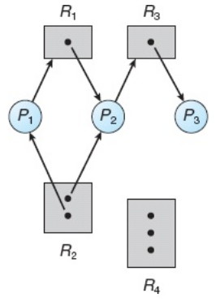
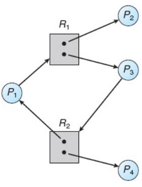
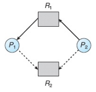
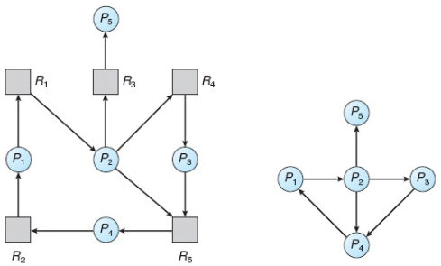

# -*- coding: utf-8 -*-
# -*- mode: org -*-
#+startup: beamer overview indent
#+LANGUAGE: pt-br
#+TAGS: noexport(n)
#+EXPORT_EXCLUDE_TAGS: noexport
#+EXPORT_SELECT_TAGS: export

#+Title: Sistemas Operacionais
#+Subtitle: Deadlocks
#+Author: Prof. Lucas Mello Schnorr (UFRGS)
#+Date: \copyleft

#+LaTeX_CLASS: beamer
#+LaTeX_CLASS_OPTIONS: [xcolor=dvipsnames,10pt]
#+OPTIONS: H:1 num:t toc:nil \n:nil @:t ::t |:t ^:t -:t f:t *:t <:t
#+LATEX_HEADER: \input{org-babel.tex}

* Estrutura da aula

- Noção de deadlock
  - Modelo de sistema
  - Condições necessárias (Coffman)
  - Grafo de alocação de recursos
- Tratamento de deadlocks
  - Algoritmo do avestruz (ignorar)
  - Prevenção (/Deadlock Prevention/)
  - Evitação (/Deadlock Avoidance/ — Algoritmo do Banqueiro)
  - Detecção e recuperação

* Motivação e Definição

Um processo solicita recursos; se indisponíveis, o processo espera
- Em alguns casos, o processo em espera jamais muda de estado

#+latex: \vfill

Deadlock: situação em que processos esperam indefinidamente uns pelos outros
- Um conjunto de processos em deadlock: cada processo espera por um
  evento que somente outro processo do conjunto pode causar
- Nenhum dos processos pode executar, liberar recursos ou ser acordado

#+latex: \vfill

Exemplo clássico (lei do Kansas, séc. XX):
- "Quando dois trens se aproximam em um cruzamento, ambos devem parar"
- "Nenhum deve mover-se até que o outro tenha partido"

* Exemplo: Deadlock com Pthreads

#+begin_src C
pthread_mutex_t first_mutex;
pthread_mutex_t second_mutex;

void *do_work_one(void *param) {
    pthread_mutex_lock(&first_mutex);
    sleep(1);
    pthread_mutex_lock(&second_mutex);
    /* trabalho */
    pthread_mutex_unlock(&second_mutex);
    pthread_mutex_unlock(&first_mutex);
    pthread_exit(0);
}

void *do_work_two(void *param) {
    pthread_mutex_lock(&second_mutex);
    sleep(1);
    pthread_mutex_lock(&first_mutex);
    /* trabalho */
    pthread_mutex_unlock(&first_mutex);
    pthread_mutex_unlock(&second_mutex);
    pthread_exit(0);
}
#+end_src

* Modelo de Sistema

Um sistema possui recursos de vários tipos, cada um com instâncias
- Exemplos: ciclos de CPU, arquivos, dispositivos de I/O, memória

#+latex: \vfill

Recursos: preemptíveis e não preemptíveis
- Preemptível: pode ser retirado sem causar prejuízo (ex: memória)
- Não preemptível: não pode ser tomado sem causar falha (ex: gravador)
- Impasses geralmente envolvem recursos não preemptíveis

#+latex: \vfill

Sequência de uso de um recurso por um processo:
1. Solicitação — processo pede o recurso; se indisponível, espera
2. Uso — processo opera sobre o recurso
3. Liberação — processo libera o recurso

* Condições de Coffman (1/2)

Coffman et al. (1971): quatro condições necessárias para um deadlock

#+latex: \vfill

Condição 1 — Exclusão mútua
- Pelo menos um recurso deve ser mantido em modo não compartilhável
- Apenas um processo por vez pode usar o recurso
- Não é possível negar essa condição para recursos intrinsecamente exclusivos

#+latex: \vfill\pause

Condição 2 — Posse e espera
- Um processo deve estar de posse de pelo menos um recurso
- E ao mesmo tempo esperando por recursos retidos por outros processos
- Alternativa: solicitar todos os recursos antes de iniciar a execução

* Condições de Coffman (2/2)

Condição 3 — Não preempção
- Recursos não podem ser forçosamente retirados de um processo
- Um recurso é liberado somente de forma voluntária pelo processo dono
- Aplicável quando o estado do recurso pode ser salvo e restaurado

#+latex: \vfill\pause

Condição 4 — Espera circular
- Deve existir uma cadeia circular de processos P0, P1, …, Pn tal que:
- P0 espera por recurso de P1; P1 espera por recurso de P2; …
- Pn espera por recurso de P0
- Pode ser eliminada impondo ordem numérica global nos recursos

#+latex: \vfill

Todas as quatro condições devem estar presentes simultaneamente
- A ausência de qualquer uma delas impede a ocorrência de deadlock

* Grafo de Alocação de Recursos

Grafo dirigido usado para descrever formalmente o estado de alocação
- *Modelo que reflete a alocação de recursos* (c/ representação gráfica)

#+latex: \vfill

** Elementos

Dois tipos de vértices:
- P = {P1, P2, …, Pn}: processos ativos (círculos)
- R = {R1, R2, …, Rm}: tipos recursos (retângulos; instâncias são pontos)

#+latex: \pause

Dois tipos de arestas:
- Solicitação: Pi \to Rj (Pi solicitou instância de Rj e aguarda)
- Atribuição: Rj → Pi (instância de Rj está alocada a Pi)

#+latex: \vfill\pause

** Comportamento
1. Pi \to Rj (solicitação) @@latex: \pause @@
2. [solicitação atendida, aresta de solicitação se transforma em atribuição]  @@latex: \pause @@
3. Rj \to Pi (atribuição)

* Grafo de Alocação com Deadlock

Suponha P = {P1, P2, P3} e R = {R1, R2, R3, R4}

#+latex: \vfill

** Right                                                             :BMCOL:
:PROPERTIES:
:BEAMER_col: 0.28
:END:

** Left                                                              :BMCOL:
:PROPERTIES:
:BEAMER_col: 0.70
:END:

#+latex: \pause

Se P3 \to R2 (atribuído a P1 e P2), surgem 2 ciclos:
- P1 → R1 → P2 → R3 → P3 → R2 → P1
- P2 → R3 → P3 → R2 → P2 @@latex: \linebreak@@
Os processos P1, P2 e P3 estão em deadlock

** Normal                                                  :B_ignoreheading:
:PROPERTIES:
:BEAMER_env: ignoreheading
:END:

#+latex: \vfill\pause

** Regras de análise do grafo
- Sem ciclo no grafo: nenhum deadlock
- Ciclo com uma instância por tipo de recurso: deadlock garantido
- Ciclo com múltiplas instâncias: pode ou não haver deadlock

* Grafo de Alocação sem Deadlock

Um ciclo no grafo não implica necessariamente deadlock

#+latex: \vfill

** Left                                                              :BMCOL:
:PROPERTIES:
:BEAMER_col: 0.3
:END:

** Right                                                             :BMCOL:
:PROPERTIES:
:BEAMER_col: 0.70
:END:

Exemplo com ciclo mas sem deadlock:
- Ciclo: P1 → R1 → P3 → R2 → P1 
- P4 pode liberar R2 → recurso vai para P3
- P3 termina → ciclo é rompido → sem deadlock

#+latex: \vfill\pause

** Conclusão
- Ciclo é condição necessária mas não suficiente para deadlock
- Com múltiplas instâncias de um mesmo tipo, é preciso analisar mais

* Métodos para Tratamento de Deadlocks

Três abordagens gerais:

#+latex: \vfill

1. Prevenção e evitação (deadlock nunca ocorre)
   - Assegurar que pelo menos uma condição de Coffman não ocorra
   - Ou usar informações antecipadas para evitar estados inseguros
2. Detecção e recuperação (deadlock pode ocorrer)
   - Algoritmo examina o estado do sistema periodicamente
   - Ao detectar, o sistema executa uma ação de recuperação
3. Ignorar o problema (algoritmo do avestruz)
   - Responsabilidade transferida ao desenvolvedor da aplicação

* Algoritmo do Avestruz

Estratégia mais simples: fingir que o problema não existe

#+latex: \vfill

Perspectiva de engenharia:
- Se deadlocks ocorrem uma vez a cada 5 anos, o custo pode não justificar
- Quedas por falhas de hardware ou SO ocorrem muito mais frequentemente
- Pagar alto preço em desempenho para eliminar evento raro não é razoável

#+latex: \vfill\pause

Perspectiva matemática:
- Deadlocks devem ser evitados a todo custo — solução inaceitável

#+latex: \vfill\pause

Adotado pela maioria dos sistemas operacionais de propósito geral
- Cabe ao programador de aplicações prevenir e tratar deadlocks

* Prevenção: Exclusão Mútua e Posse e Espera

Prevenir deadlocks: assegurar que ao menos uma condição não ocorra

#+latex: \vfill

Atacar exclusão mútua:
- Tornar recursos somente para leitura quando possível
  - Exemplo: arquivos abertos em modo de leitura
- Técnica de spooling da impressora: um /daemon/ controla
  - Processos enviam o arquivo quando todo ele está disponível
- Não aplicável a recursos intrinsecamente não compartilháveis
  - Exemplo: Trava /mutex/

#+latex: \vfill\pause

Atacar posse e espera:
- Protocolo 1: processo solicita todos os recursos antes de iniciar
- Protocolo 2: processo libera tudo que possui antes de pedir mais
- Desvantagem: baixa utilização de recursos
- Desvantagem: possível inanição de processos

* Prevenção: Não Preempção e Espera Circular

Atacar não preempção:
- Um protocolo possível
  - Se processo retém recursos e novo pedido é negado: libera tudo
  - Recursos liberados são adicionados à lista de espera do processo
  - Processo reinicia somente quando recuperar todos os recursos
- Aplicável apenas a recursos com estado facilmente salvo (CPU, memória)
- Não se aplica a locks mutex e semáforos

#+latex: \vfill\pause

Atacar espera circular:
- Impor uma ordem numérica global a todos os tipos de recursos (F: R → N)
- Um protocolo possível
  - Processo pode solicitar Rj somente se F(Rj) > F(Ri) para todo Ri retido
- Com essa regra, o grafo de alocação jamais contém ciclos
- Exemplo: processo pode pedir impressora depois de fita, mas não antes

* Evitação: Estado Seguro                                          :noexport:

Estado seguro: o sistema pode alocar recursos a cada processo até o
máximo e ainda assim evitar deadlock

#+latex: \vfill

Sequência segura <P1, P2, …, Pn>:
- Para cada Pi, seus recursos futuros podem ser atendidos pelos
  recursos disponíveis mais os recursos liberados por todos Pj com j < i

#+latex: \vfill

Relação entre estados:
- Estado seguro → sem deadlock (garante conclusão de todos)
- Estado inseguro → não necessariamente deadlock (mas sem garantia)
- Estado de deadlock → estado inseguro

#+latex: \vfill

Algoritmo de evitação:
- Ao receber solicitação, verificar se a alocação mantém estado seguro
- Se sim: alocar; se não: processo espera

* Evitação: Algoritmo do Grafo de Alocação de Recursos 1/2

Aplica-se quando há *apenas uma instância* de cada tipo de recurso

#+latex: \vfill\pause

** Novo tipo de aresta: aresta de requisição

- =Pi → Rj= tracejada: Pi *pode* solicitar Rj no futuro
- Ao solicitar: aresta de requisição → aresta de solicitação
- Ao liberar: aresta de atribuição → aresta de requisição

#+latex: \vfill\pause

** Restrição a priori

- Antes de Pi iniciar, *todas* as suas arestas de requisição estão no grafo
# - Pode-se abrandar: adicionar =Pi → Rj= somente se Pi tiver apenas arestas de requisição

#+latex: \pause

** Protocolo
- Ao processar a solicitação de =Pi= pelo recurso =Rj=:
  #+begin_src
  Objetivo: converter Pi → Rj  (solicitação) em Rj → Pi  (atribuição)
  #+end_src
- Verificação de segurança
  - Executar algoritmo de *detecção de ciclos* no grafo resultante
  - Complexidade: =O(n²)=, onde n = número de processos

| Sem ciclo | estado *seguro*   | alocação permitida |
| Com ciclo | estado *inseguro* | Pi deve *esperar*    |

* Evitação: Algoritmo do Grafo de Alocação de Recursos 1/2

** Um exemplo

** Left                                                              :BMCOL:
:PROPERTIES:
:BEAMER_col: 0.3
:END:

** Right                                                             :BMCOL:
:PROPERTIES:
:BEAMER_col: 0.7
:END:
#+latex: \vfill

- P2 solicita R2 (livre)
- Por que não alocar?
  - Converter a aresta *criaria um ciclo* no grafo
  - Ciclo \to estado inseguro \to risco de deadlock

** Cenário de deadlock resultante

Se a alocação fosse feita e em seguida:
- P1 solicitar R2, *e*
- P2 solicitar R1

#+latex: \pause

** \to Deadlock inevitável
* Evitação: Algoritmo do Banqueiro

Desenvolvido por Dijkstra (1965); lida com múltiplas instâncias
- É um algoritmo de evitação
- Origem do nome: assegurar que o banco nunca alocasse seu dinheiro
  disponível de tal modo que não pudesse mais satisfazer as
  necessidades de todos os seus clientes

#+latex: \vfill\pause

Estruturas de dados (n processos, m tipos de recursos):
- Disponível[m]: número de instâncias disponíveis de cada tipo
- Max[n][m]: demanda máxima declarada de cada processo
- Alocação[n][m]: recursos de cada tipo alocados a cada processo
- Necessidade[n][m] = Max[n][m] - Alocação[n][m]

#+latex: \vfill

Ao entrar no sistema, cada processo declara sua necessidade máxima
- Ao solicitar recursos, o SO simula a alocação e verifica segurança
- Se o estado resultante for seguro: aloca; caso contrário: aguarda

* Evitação: Algoritmo do Banqueiro (2/2)                           :noexport:
** Algoritmo de segurança

Verifica se um sistema está ou não em um estado seguro

Protocolo
1. Trabalho = Disponível; Término[i] = false para todo i
2. Encontrar i tal que Término[i]=false e Necessidade_i <= Trabalho
3. Trabalho = Trabalho + Alocação_i; Término[i] = true; voltar ao 2
4. Se Término[i]=true para todo i: estado seguro

#+latex: \vfill\pause

** Algoritmo de solicitação para processo Pi:
1. Se Solicitação_i > Necessidade_i: erro (excede máximo declarado)
2. Se Solicitação_i > Disponível: Pi espera (recursos insuficientes)
3. Simular: Disponível -= Solicitação_i; Alocação_i += Solicitação_i;
   Necessidade_i -= Solicitação_i
4. Se estado resultante é seguro: efetivar; senão: reverter e Pi espera

* Detecção: Grafo de Espera

Aplica-se quando há *apenas uma instância* de cada tipo de recurso

#+latex: \vfill

** Left                                                              :BMCOL:
:PROPERTIES:
:BEAMER_col: 0.40
:END:
Grafo de espera
- Derivado do grafo de alocação removendo os nós de recursos
- Aresta Pi → Pj: Pi espera que Pj libere um recurso necessário

** Right                                                             :BMCOL:
:PROPERTIES:
:BEAMER_col: 0.6
:END:

#+latex: \vfill

** Algoritmo de detecção (busca em profundidade):
- Existe deadlock se e somente se o grafo de espera contiver ciclo
- Para detectar ciclo: percorrer todos os nós marcando os arcos visitados
- Se um nó aparecer duas vezes na lista de visita: ciclo detectado

#+latex: \vfill

** SO mantém o grafo e periodicamente invoca o algoritmo
- Custo: O(n²) sendo n o número de processos

* Detecção: Múltiplos Recursos                                     :noexport:

Usado quando tipos de recursos possuem múltiplas instâncias

#+latex: \vfill

Estruturas de dados:
- Disponível[m]: instâncias disponíveis por tipo
- Alocação[n][m]: recursos alocados a cada processo
- Solicitação[n][m]: solicitações correntes de cada processo

#+latex: \vfill

Algoritmo de detecção:
1. Trabalho = Disponível; Término[i] = false se Alocação_i != 0
2. Encontrar i: Término[i]=false e Solicitação_i <= Trabalho
3. Trabalho = Trabalho + Alocação_i; Término[i] = true; voltar ao 2
4. Se Término[i]=false para algum i: Pi está em deadlock

#+latex: \vfill

Quando invocar o algoritmo de detecção:
- Uma vez por hora ou quando utilização da CPU cair abaixo de 40%

* Recuperação de Deadlocks

Ao detectar deadlock, duas abordagens principais:

#+latex: \vfill

** Encerramento de processos:
- Abortar todos os processos em deadlock (alto custo, retrabalho)
- Abortar um processo por vez até romper o ciclo (custo incremental)
- Critérios para escolha da vítima: prioridade, tempo de execução,
  recursos utilizados, número de processos afetados

#+latex: \vfill

** Preempção de recursos:
- Tomar recursos de um processo e cedê-los a outro até romper ciclo
- Seleção da vítima: minimizar custo
- Rollback: retornar o processo a um estado seguro anterior (checkpoint)
- Inanição: garantir que o mesmo processo não seja sempre escolhido

* Referências

- Silberchatz
  - Cap. 7, Secs. 7.1, 7.2, 7.3, 7.4
- Tanenbaum
  - Cap. 6, Secs. 6.1, 6.2, 6.3, 6.4, 6.5, 6.6
