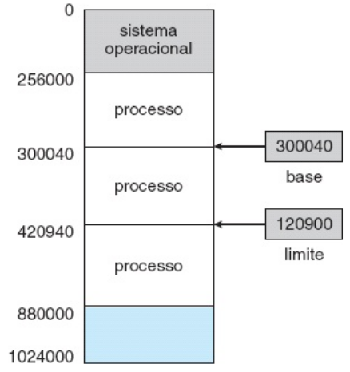
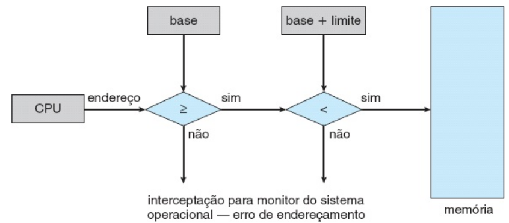
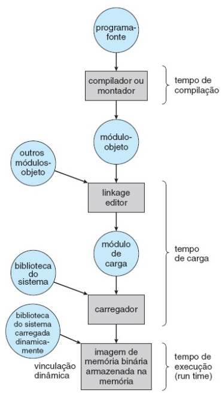
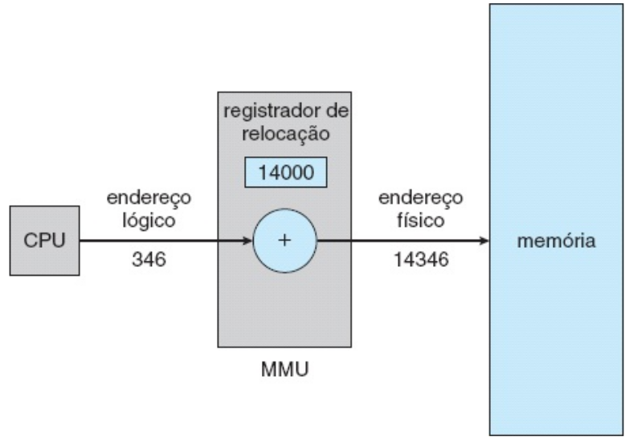
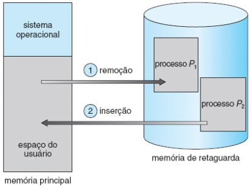

# -*- coding: utf-8 -*-
# -*- mode: org -*-
#+startup: beamer overview indent
#+LANGUAGE: pt-br
#+TAGS: noexport(n)
#+EXPORT_EXCLUDE_TAGS: noexport
#+EXPORT_SELECT_TAGS: export

#+Title: Sistemas Operacionais
#+Subtitle: Gerência de Memória: Introdução
#+Author: Prof. Lucas Mello Schnorr (UFRGS)
#+Date: \copyleft

#+LaTeX_CLASS: beamer
#+LaTeX_CLASS_OPTIONS: [xcolor=dvipsnames,10pt]
#+OPTIONS: H:1 num:t toc:nil \n:nil @:t ::t |:t ^:t -:t f:t *:t <:t
#+LATEX_HEADER: \input{org-babel.tex}

* Estrutura da aula

- Introdução
  - Motivação da gerência de memória
  - Níveis de memória
- Sem abstração de memória
  - Hardware básico: proteção com registradores
  - Conceito de espaços de endereçamento
- Vinculação de endereços e carregadores
- Endereços lógicos e físicos — MMU
- Carga dinâmica
  - Vinculação dinâmica e bibliotecas compartilhadas
- Troca de processos (/Swapping/)
  - Permuta-padrão
  - Permuta em sistemas móveis

* Motivação: Gerência de Memória

A memória é essencial para a operação de sistemas modernos

- A CPU extrai instruções da memória conforme o contador do programa
- Instruções podem carregar e armazenar em endereços específicos
- Dados precisam estar na memória para a CPU operar sobre eles

#+latex: \vfill

Dois objetivos principais da gerência de memória:

- Desempenho: hierarquia registradores–cache–memória–disco
- Proteção: SO deve proteger processos uns dos outros
  - Expor memória física a processos tem desvantagens graves
  - Programas podem derrubar o SO intencionalmente ou por acidente

* Níveis de Memória

A CPU acessa diretamente registradores e memória principal

- Registradores: internos à CPU, acessados em um ciclo de relógio
- Cache: no chip da CPU, gerenciada automaticamente pelo hardware
- Memória principal: acessada via barramento, pode levar muitos ciclos
  - CPU pode ser interrompida enquanto aguarda dado da memória

#+latex: \vfill

Armazenamento em disco não é acessível diretamente pela CPU

- Dados em disco devem ser transferidos à memória antes de serem usados
- Hierarquia: equilíbrio entre velocidade, custo e capacidade

* -- Sem Abstração de Memória

Primeiros computadores não tinham abstração de memória

- Cada programa endereçava diretamente a memória física
- Modelo de memória: array de endereços de 0 a máximo
- Apenas um processo de cada vez podia estar na memória

#+latex: \vfill

Ainda há situações sem abstração de memória atualmente

- Sistemas embarcados simples (sem SO ou com SO como biblioteca)
- Controladores de pequeno porte, cartões inteligentes
- Exemplo de SO como biblioteca: e-Cos

* Executando Múltiplos Programas sem Abstração

Sem abstração, dois programas não coexistem na memória com segurança

- Qualquer escrita por um programa pode corromper o outro
- Ambos referenciam endereços físicos absolutos diretamente

#+latex: \vfill

Solução temporária usada no IBM 360: realocação estática

- Ao carregar no endereço 16.384, soma-se 16.384 a cada endereço
- Limitações:
  - Torna lento o processo de carregamento
  - Exige informações adicionais em todos os executáveis
  - Não é uma solução geral

* Hardware Básico: Proteção com Registradores

Cada processo deve ter espaço de memória separado

- Protege processos uns contra os outros
- Fundamental para múltiplos processos simultâneos na memória

#+latex: \vfill

** Left                                                              :BMCOL:
:PROPERTIES:
:BEAMER_col: 0.58
:END:

Proteção com dois registradores de hardware:

- Registrador base: menor endereço físico válido do processo
- Registrador limite: tamanho do intervalo de endereços válidos
- Hardware verifica cada endereço gerado pelo processo de usuário
  - Violação → interceptação para o SO (erro fatal)

** Right                                                             :BMCOL:
:PROPERTIES:
:BEAMER_col: 0.38
:END:

* Ilustrando a desvantagem da proteção com registradores
** Desvantagem

Apenas o SO pode modificar os registradores (instrução privilegiada)

Necessidade de adição e comparação a cada acesso à memória

#+latex: \vfill

* Uma abstração melhor: Espaço de Endereçamento

Dois problemas a resolver para múltiplos programas simultâneos:

1. Proteção: impedir que um processo acesse memória de outro
2. Realocação: permitir carregamento em qualquer posição da memória

#+latex: \vfill\pause
   
** Espaço de endereçamento: abstração de memória para processos

- Conjunto de endereços que um processo pode usar
- Cada processo tem seu próprio espaço, independente dos outros
- Processo → CPU abstrata; espaço de endereçamento → memória abstrata

* -- Vinculação de Endereços
** Left                                                              :BMCOL:
:PROPERTIES:
:BEAMER_col: 0.58
:END:

Passos do programa antes da execução

- Programa em disco → carregado na memória → inserido em processo
- Endereços mudam de representação ao longo desses passos
  - Simbólicos (código-fonte): ex. variável =count=
  - Relocáveis (compilados): "14 bytes a partir desse módulo"
  - Absolutos (carregados): ex. endereço 74014

#+latex: \vfill

Vinculação de endereços em tempos distintos:

- Tempo de compilação: posição na memória conhecida antecipadamente
- Tempo de carga: endereço inicial só é conhecido ao carregar
- Tempo de execução: processo pode mudar de posição durante execução

** Right                                                             :BMCOL:
:PROPERTIES:
:BEAMER_col: 0.38
:END:

* Carregadores: Absoluto, Relocador e Dinâmico

Três tipos de carregadores, correspondentes aos momentos de vinculação:

#+latex: \vfill

- Carregador absoluto (tempo de compilação)
  - Programa gerado com endereços físicos fixos
  - Deve sempre ser carregado no mesmo endereço

#+latex: \vfill

- Carregador relocador (tempo de carga)
  - Compilador gera código relocável
  - Endereços ajustados no carregamento, somando o endereço base

#+latex: \vfill

- Carregador dinâmico (tempo de execução)
  - Rotinas carregadas conforme necessário
  - Base para carga dinâmica e vinculação dinâmica

* -- Endereços Lógicos e Físicos

** Conceito
- Endereço lógico: gerado pela CPU (também chamado endereço virtual)
  - Memória Virtual (espaço de endereçamento virtual)
- Endereço físico: visto pela unidade de memória (no barramento)

#+latex: \vfill

Relação entre endereços lógicos e físicos depende do momento de vinculação:

- Vinculação em compilação/carga: endereços lógicos = físicos
- Vinculação em tempo de execução: endereços lógicos != físicos

#+latex: \vfill

- Espaço de endereçamento lógico: conjunto de endereços gerados pela CPU
- Espaço de endereçamento físico: endereços vistos pela memória
- Separação entre os dois espaços é essencial para a gerência de memória

* MMU: Unidade de Gerência de Memória

MMU (/Memory Management Unit/): mapeia endereços lógicos para físicos

#+latex: \vfill

Esquema simples: registrador de relocação

- Valor do registrador somado a cada endereço gerado pelo processo
- Ex: base=14000, acesso ao endereço 346 → endereço físico 14346

#+attr_latex: :width .5\linewidth

#+latex: \vfill

O programa do usuário opera somente com endereços lógicos (0 a max)

- Nunca vê os endereços físicos reais
- Hardware converte endereços lógicos (0..max) para físicos (R..R+max)
- Vinculação em tempo de execução feita pelo hardware da MMU

* -- Carga Dinâmica

Carga dinâmica: rotina não é carregada até ser chamada

- Rotinas mantidas em disco em formato relocável
- Carregamento ocorre quando a rotina é invocada pela primeira vez
- Se rotina não está na memória, carregador de vinculação a carrega

#+latex: \vfill

Vantagem: útil para código raramente executado (ex: rotinas de erro)

- Tamanho total do programa pode ser grande
- Parte efetivamente carregada na memória pode ser muito menor

#+latex: \vfill

- Não requer suporte especial do SO
- Responsabilidade do programador projetar para aproveitar o recurso

* Vinculação Dinâmica e Bibliotecas Compartilhadas

Vinculação estática: bibliotecas incorporadas à imagem binária

- Cada executável inclui sua própria cópia das rotinas usadas
- Desperdício de espaço em disco e memória principal

#+latex: \vfill

Vinculação dinâmica: adiada até o tempo de execução

- Um /stub/ é incluído para cada referência a rotinas da biblioteca
- /Stub/: fragmento de código que localiza (ou carrega) a rotina
- Na primeira execução do /stub/: rotina é carregada e /stub/ substituído
- Nas execuções seguintes: rotina é chamada diretamente

#+latex: \vfill

- Todos os processos compartilham uma única cópia do código
- Facilita atualização de bibliotecas (correções de bugs)
- Também chamado de bibliotecas compartilhadas; requer suporte do SO

* -- Troca de Processos: Conceito e Motivação

Troca de processos (/swapping/): processo transferido da memória ao disco

- Trazido de volta à memória quando precisa ser executado
- Permite que o total de espaços de endereçamento exceda a RAM
- Aumenta o grau de multiprogramação

#+latex: \vfill

Em sistemas típicos, dezenas a centenas de processos são iniciados:

- Windows, macOS e Linux: 50–100 processos ou mais ao ligar
- A RAM demandada por todos supera em muito a memória disponível

#+latex: \vfill

Estratégia /swapping/:

- Traz cada processo completo à memória, executa por um tempo
- Devolve ao disco; processos ociosos não ocupam memória

* Troca de Processos: Permuta-Padrão

Memória de retaguarda: disco veloz para armazenar imagens de memória

- Custo alto:
  - Processo de 100 MB, disco a 50 MB/s → 2 s para transferir
  - Remoção + inserção → \approx4s no total

#+latex: \vfill

Permuta-padrão não usada em SO modernos

- Requer muito tempo, fornece pouco tempo útil de execução
- Versões modificadas no UNIX, Linux e Windows
  - Ativada apenas quando memória livre cai abaixo de um limite

#+attr_latex: :width .3\linewidth

#+latex: \vfill

Compactação de memória: mover processos para unir espaços livres

- Custo muito alto: máquina de 16 GB → \approx16 s para compactar a memória

* Troca de Processos em Sistemas Móveis                            :noexport:

Sistemas móveis não suportam /swapping/ convencional

- Usam memória flash (não disco rígido) como armazenamento persistente
- Número limitado de gravações na flash antes de deteriorar
- Fraco /throughput/ entre memória principal e flash

#+latex: \vfill

iOS (Apple): solicitação de liberação voluntária de memória

- Código (somente leitura): removido e recarregado conforme necessário
- Dados modificados (pilha): nunca removidos
- Aplicações que não liberam memória suficiente: encerradas pelo SO

#+latex: \vfill

Android: encerra processos se necessário

- Grava estado da aplicação na flash antes de encerrar
- Permite reinicialização rápida do estado
- Tanto iOS quanto Android suportam paginação

* -- Gerenciando Memória Livre

Duas abordagens para rastrear uso de memória:

#+latex: \vfill

- Mapa de bits
  - Memória dividida em unidades de alocação
  - Um bit por unidade: 0=livre, 1=ocupado
  - Mapa ocupa 1/32 da memória (com unidade de 32 bits)
  - Desvantagem: busca lenta por k bits 0 consecutivos

#+latex: \vfill

- Lista encadeada
  - Entradas: tipo (P=processo, L=livre), endereço, comprimento
  - Algoritmos: /first fit/, /next fit/, /best fit/, /worst fit/

* Referências

- Silberchatz
  - Cap. 8, Secs. 8.1, 8.2
- Tanenbaum
  - Cap. 3, Secs. 3.1, 3.2
