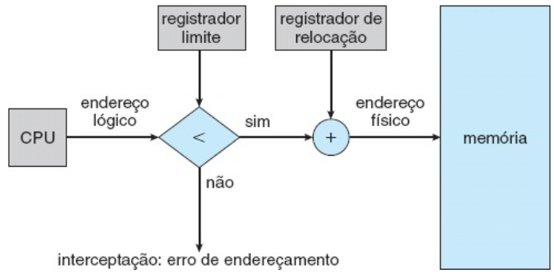
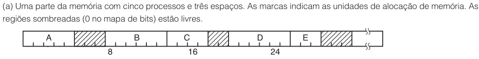
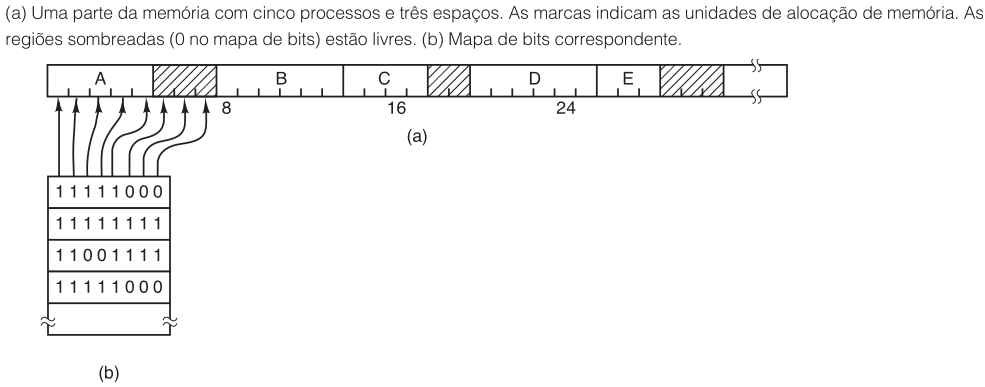
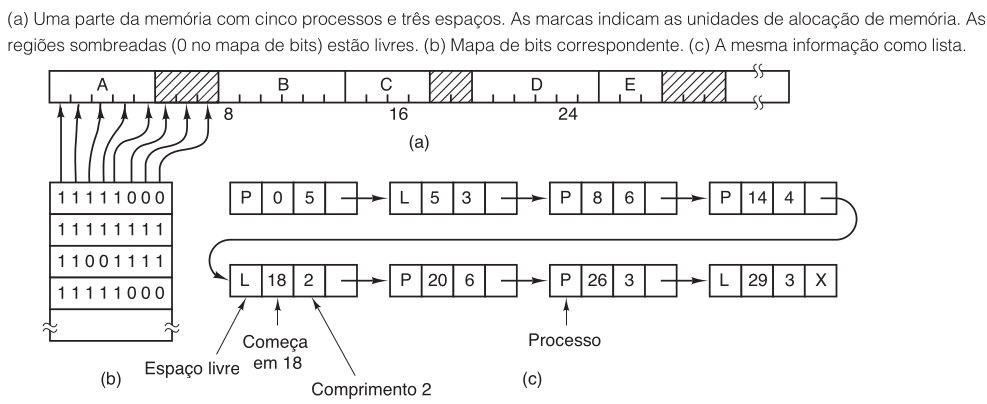

# -*- coding: utf-8 -*-
# -*- mode: org -*-
#+startup: beamer overview indent
#+LANGUAGE: pt-br
#+TAGS: noexport(n)
#+EXPORT_EXCLUDE_TAGS: noexport
#+EXPORT_SELECT_TAGS: export

#+Title: Sistemas Operacionais
#+Subtitle: Gerência de Memória: Alocação Contígua
#+Author: Prof. Lucas Mello Schnorr (UFRGS)
#+Date: \copyleft

#+LaTeX_CLASS: beamer
#+LaTeX_CLASS_OPTIONS: [xcolor=dvipsnames,10pt]
#+OPTIONS: H:1 num:t toc:nil \n:nil @:t ::t |:t ^:t -:t f:t *:t <:t
#+LATEX_HEADER: \input{org-babel.tex}

* Estrutura da aula

- Alocação contígua de memória
  - Proteção de memória
    - Registradores de relocação e limite
    - Despachante e troca de contexto
  - Particionamento da memória
    - Particionamento estático
    - Particionamento dinâmico (brechas)
    - Estratégias: primeiro-apto, mais-apto, menos-apto
  - Fragmentação
    - Fragmentação externa (regra dos 50%)
    - Fragmentação interna (compactação)
- Gerenciando a memória livre
  - Mapa de bits
  - Lista encadeada e algoritmos de alocação

* Motivação: Alocação Contígua

Memória deve acomodar SO e processos de usuário simultaneamente

- Na alocação contígua, cada processo ocupa seção ininterrupta
- Memória dividida em duas partes: SO residente e processos de usuário
  - Vetor de interrupções costuma estar na memória baixa
  - SO geralmente alocado na parte baixa da memória

#+latex: \vfill

- Vários processos de usuário na memória ao mesmo tempo é o objetivo
- Processos aguardam em fila de entrada para serem carregados

* -- Proteção de Memória

- Impedimos que processo acesse memória que não lhe pertence
- Combina dois registradores de hardware: relocação e limite

#+latex: \vfill

** Left                                                              :BMCOL:
:PROPERTIES:
:BEAMER_col: 0.53
:END:

- Registrador de relocação: menor endereço físico do processo
- Registrador limite: intervalo de endereços lógicos permitidos
- Endereço lógico validado contra o registrador limite
- MMU soma endereço lógico ao registrador de relocação
- Violação → interceptação pelo SO (erro fatal)

** Right                                                             :BMCOL:
:PROPERTIES:
:BEAMER_col: 0.45
:END:

* Proteção de Memória: Despachante

- Scheduler seleciona processo; despachante realiza a troca de contexto
- Despachante carrega registradores de relocação e limite corretamente
- Todo endereço gerado pela CPU é verificado contra os registradores

#+latex: \vfill

** Código do SO
- Esquema permite que tamanho do SO mude dinamicamente
  - Drivers de dispositivos nem sempre precisam estar em memória
  - Partes carregadas somente quando necessárias
- Código que entra e sai da memória conforme necessário: transiente

* -- Particionamento Estático

- Método mais simples: dividir memória em partições de tamanho fixo
- Cada partição contém exatamente um processo
- Grau de multiprogramação limitado pelo número de partições

#+latex: \vfill

- Quando partição está livre, processo da fila de entrada é carregado
- Quando processo termina, partição torna-se disponível
- Método histórico: IBM OS/360
  - MFT == /Multiprogramming with a Fixed number of Tasks/
- Problema: tamanhos diferentes de processos → desperdício de memória

* Particionamento Dinâmico: Brechas

- Partições variáveis: generalização das partições fixas
  - MVT  == /Multiprogramming with a Variable number of Tasks/
- SO mantém tabela indicando partes disponíveis e ocupadas
- Inicialmente toda memória disponível: um grande bloco, uma brecha

#+latex: \pause

** Carregamento de Processos

- Processos entram no sistema e vão para a fila de entrada
- SO considera requisitos de memória e memória disponível
- Processo que recebe espaço é carregado e compete por CPU
- Processo que termina libera memória → SO preenche com outro da fila

#+latex: \vfill\pause

** Detalhes de funcionamento

- SO mantém lista de brechas e fila de entrada
- Fila de entrada pode ser ordenada por algoritmo de escalonamento
- Processo espera se nenhuma brecha suficientemente grande existir
  - Ou SO busca na fila outro processo com requisito menor

* Particionamento Dinâmico: Divisão e Fusão de Brechas

** Problema
- Com o tempo, memória contém brechas de vários tamanhos
  - Brechas: espaços livres espalhados pela memória
- Processos e brechas alternam-se na memória ao longo do tempo    

** Lidando com as brechas
- Ao alocar: brecha grande demais é dividida em duas partes
  - Uma parte alocada ao processo; outra devolvida ao conjunto
- Ao liberar: bloco retorna ao conjunto de brechas
  - Brechas adjacentes são fundidas em uma brecha maior

#+latex: \vfill\pause

** Resolvendo o problema

- Fusão é essencial para evitar fragmentação progressiva

* Estratégias de Alocação

Dado pedido de tamanho n, escolher brecha a partir da lista de brechas

#+latex: \vfill

- Primeiro-apto (/first fit/): primeira brecha suficientemente grande
  - Busca pode começar no início ou onde terminou a última busca
- Mais-apto (/best fit/): menor brecha suficientemente grande
  - Exige percorrer lista inteira; produz brechas residuais menores
- Menos-apto (/worst fit/): maior brecha disponível
  - Exige percorrer lista inteira; produz brechas residuais maiores

#+latex: \vfill

- Simulações: primeiro-apto e mais-apto superam menos-apto
- Primeiro-apto e mais-apto equivalentes; primeiro-apto mais rápido

* -- Fragmentação Externa

- Primeiro-apto e mais-apto sofrem de fragmentação externa
- Fragmentação externa: memória livre total suficiente, mas dispersa
  - Memória fragmentada em muitas pequenas brechas não contíguas

#+latex: \vfill

- Na pior hipótese: um bloco desperdiçado entre cada par de processos
- Regra dos 50%: dados N blocos alocados, \approx 0,5N blocos são perdidos
  - Um terço da memória pode ficar inutilizável

* Fragmentação Interna

- Fragmentação interna: memória alocada supera memória solicitada
  - Diferença é interna ao bloco alocado — ninguém mais pode usá-la

#+latex: \vfill

- Causa: particionar memória em blocos de tamanho fixo
  - Brecha de 18.464 bytes, processo pede 18.462 → sobram 2 bytes
  - Overhead de gerenciar a brecha residual supera o benefício

#+latex: \vfill

- Solução: alocar em múltiplos de uma unidade de bloco fixo
  - Memória alocada pode ser ligeiramente maior que a solicitada

* Compactação

- Compactação: unir todas as brechas em um único bloco livre
  - Mover processos para uma extremidade; brechas para a outra

#+latex: \vfill

- Condição necessária: relocação dinâmica em tempo de execução
  - Relocação estática (compilação/carga) → compactação impossível
  - Com relocação dinâmica: atualiza registrador base para novo endereço

#+latex: \vfill

- Custo elevado:
  - Máquina de 16 GB copiando 8 bytes em 8 ns → \approx 16 s para compactar

* Para Além da Alocação Contígua

- Outra solução: permitir espaço de endereçamento lógico não contíguo
  - Processo recebe memória física onde quer que esteja disponível

#+latex: \vfill

- Duas técnicas para endereçamento não contíguo:
  - Segmentação (próxima aula)
  - Paginação (próximas aulas)
  - Podem ser combinadas

#+latex: \vfill

- Fragmentação é problema geral do gerenciamento de blocos de dados
  - Ocorre também no gerenciamento de armazenamento em disco

* -- Gerenciando a Memória Livre

- Quando memória é alocada dinamicamente, SO precisa rastreá-la
- Duas abordagens principais para controlar o uso da memória:

#+attr_latex: :width \linewidth

#+latex: \vfill

** Mapa de bits
  - Divide memória em unidades de alocação
  - Um bit por unidade: 0 = livre, 1 = ocupada

** Lista encadeada
  - Entradas: tipo (P=processo, L=livre), endereço, comprimento
  - Algoritmos: /first fit/, /next fit/, /best fit/, /worst fit/

* Mapa de Bits

- Memória dividida em unidades de alocação (palavras a quilobytes)
- Um bit por unidade: 0 = livre, 1 = ocupada

#+attr_latex: :width .8\linewidth

#+latex: \vfill

- Questão de projeto: tamanho da unidade de alocação
  - Unidade de 32 bits → mapa ocupa 1/32 da memória
  - Unidade pequena → mapa grande; unidade grande → mapa menor

#+latex: \vfill

- Desvantagem principal: busca por k bits 0 consecutivos é lenta
  - Sequência pode cruzar fronteiras de palavras no mapa

* Lista Encadeada

- Lista encadeada de segmentos: espaços livres e segmentos alocados
- Cada entrada: tipo (P ou L), endereço inicial, comprimento, ponteiro

#+attr_latex: :width .8\linewidth

#+latex: \vfill

- Lista mantida ordenada por endereço
  - Facilita atualização ao término de processo
  - Quatro casos ao liberar: vizinhos P/L em combinação

#+latex: \vfill

- Ao término de processo X com vizinhos:
  - P X P → substitui entrada do processo por entrada livre
  - P X L ou L X P → funde processo e brecha em uma entrada
  - L X L → funde três entradas em uma brecha única

* Algoritmos de Alocação com Listas

- Primeiro-apto (/first fit/): primeira brecha suficientemente grande
  - Rápido — faz a menor busca possível
- Próximo-apto (/next fit/): como primeiro-apto, retoma de onde parou
  - Desempenho ligeiramente pior que primeiro-apto
- Mais-apto (/best fit/): percorre lista inteira, escolhe menor adequada
  - Lento; tende a gerar fragmentos minúsculos e inúteis
- Menos-apto (/worst fit/): escolhe sempre a maior brecha
  - Fragmento residual maior; simulações mostram baixo desempenho

#+latex: \vfill

- Aceleração: listas separadas para processos e espaços livres
- /Quick fit/: listas separadas por tamanhos comuns de blocos
  - Muito rápido para encontrar espaço do tamanho exato

* Referências

- Silberchatz
  - Cap. 8, Sec. 8.3
- Tanenbaum
  - Cap. 3, Sec. 3.2
