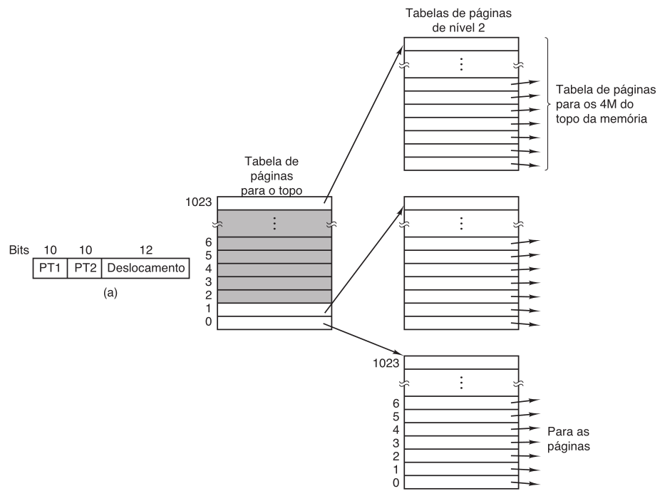
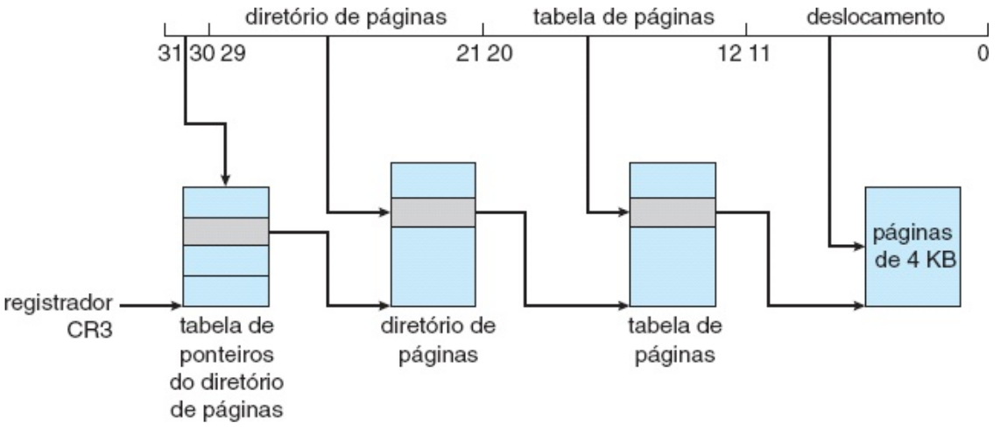
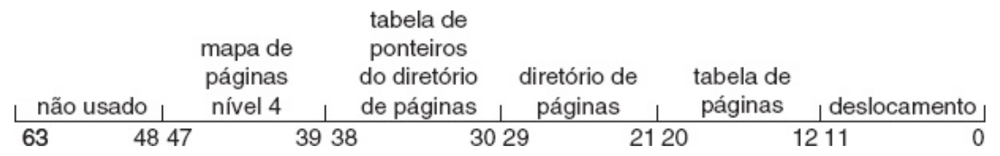
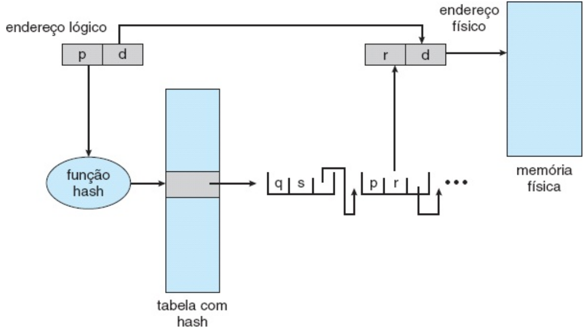
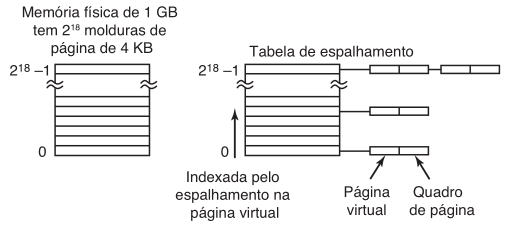

# -*- coding: utf-8 -*-
# -*- mode: org -*-
#+startup: beamer overview indent
#+LANGUAGE: pt-br
#+TAGS: noexport(n)
#+EXPORT_EXCLUDE_TAGS: noexport
#+EXPORT_SELECT_TAGS: export

#+Title: Sistemas Operacionais
#+Subtitle: Paginação Multinível e Segmentação
#+Author: Prof. Lucas Mello Schnorr (UFRGS)
#+Date: \copyleft

#+LaTeX_CLASS: beamer
#+LaTeX_CLASS_OPTIONS: [xcolor=dvipsnames,10pt]
#+OPTIONS: H:1 num:t toc:nil \n:nil @:t ::t |:t ^:t -:t f:t *:t <:t
#+LATEX_HEADER: \input{org-babel.tex}

* Estrutura da aula

- Tabelas de páginas para grandes espaços de endereçamento
  - Motivação: custo da tabela de páginas única
  - Paginação em dois níveis
  - Paginação multinível (3 ou mais níveis)
  - Tabelas de páginas com hash
  - Tabelas de páginas invertidas
  - TLB e tabelas de páginas invertidas
- Segmentação
  - Motivação: espaços de endereçamento independentes
  - Conceito e hardware de segmentação
  - Segmentação pura: fragmentação externa
  - Segmentação com paginação (MULTICS)
  - Proteção e compartilhamento
  - Comparação: paginação vs. segmentação

* Motivação: Tabelas de páginas ficaram muito grandes

Tabela de páginas única pode consumir muita memória

- Sistema de 32 bits com páginas de 4 KB
  - 2^32 / 4096 = 1048576 * 4 bytes = 4MB por processo só para a tabela
- Não convém alocar a tabela contiguamente na memória principal

#+latex: \vfill\pause

Três abordagens para atacar este problema

- Paginação hierárquica: tabela de páginas também é paginada
- Tabela com hash: agrupa entradas por valor de hash
- Tabela invertida: uma entrada por quadro físico real

* Paginação em Dois Níveis

Endereço de 32 bits: p1 (10 bits) | p2 (10 bits) | d (12 bits)

- p1: índice no diretório de páginas (tabela externa)
- p2: índice na tabela de páginas interna referenciada
- d: deslocamento dentro da página

** Left                                                              :BMCOL:
:PROPERTIES:
:BEAMER_col: 0.55
:END:
#+attr_latex: :width \linewidth

** Right                                                             :BMCOL:
:PROPERTIES:
:BEAMER_col: 0.43
:END:

Com um processo com 12MB
- 4 tabelas necessárias
  - 1\times de nível 1
  - 3\times de nível 2

#+latex: \vfill\pause

Exemplo do VAX (DEC)
- 32 bits, páginas de 512 bytes
- Lógico dividido em 4 seções de 2^30 bytes cada
- Endereço
  - Seção (2 bits)
  - Página (21 bits)
  - Deslocamento (9 bits)

* Paginação em Múltiplos Níveis

Para espaços de 64 bits, dois níveis são insuficientes

- Endereço de 64 bits, páginas de 4 KB → tabela com 2^52 entradas
- Tabela externa de dois níveis teria 2^44 bytes (16 GB)
#+latex: \vfill\pause

** Exemplos de hierarquias multinível em uso

- Pentium Pro: três níveis com extensão de endereço (PAE, até 64 GB)
  - Page Address Ext. (2 bits dedicados + entradas na tabela de 64 bits)

#+attr_latex: :width .55\linewidth    

#+latex: \pause

- Já em x86-64 (64 bits): temos quatro níveis de paginação
  - 48 bits de end. virtual (256TB) para 52 bits de end. físico (4PB)

#+attr_latex: :width .55\linewidth

* Tabelas de Páginas com Hash

Abordagem alternativa para espaços de endereçamento > 32 bits
- Número da página virtual é submetido a uma função hash
- Cada posição na tabela contém lista encadeada de elementos
  - Elemento: (número da página virtual, quadro de página, próximo)
- Ocupa memória proporcional às páginas efetivamente mapeadas

#+attr_latex: :width .45\linewidth

#+latex: \vfill\pause

** Variante agrupada \to para espaços de 64 bits esparsos
Cada entrada da tabela hash mapeia um *grupo* de páginas (ex: 16):
#+BEGIN_EXAMPLE
  entrada hash → [ VPN_base | q_0 | q_1 | ... | q_15 | próximo ]
                   cobre 16 × 4 KB = 64 KB contíguos
#+END_EXAMPLE
- 16× menos entradas para o mesmo espaço mapeado

* Tabelas de Páginas Invertidas

Tabela convencional: uma entrada por página virtual de cada processo
- Com espaços de 64 bits, isso consome memória impraticável

#+latex: \vfill\pause

Tabela de páginas invertida: _uma entrada por quadro físico real_
- Entrada: (id do processo, número da página virtual)
- Todo o sistema tem apenas uma tabela de páginas invertida
  - Tamanho proporcional à memória física, não ao espaço virtual
- Exemplos: IBM RT, PowerPC, UltraSPARC, Itanium (/Itanic/)

#+latex: \vfill\pause

Desvantagem: tradução virtual → física torna-se custosa

- Necessário pesquisar a tabela para encontrar a entrada (proc, pág)
- Pesquisa deve ocorrer a cada referência, não só em faltas de página
- Usar a TLB (cache em /hw/ de páginas) para acelerar o processo
  - Custo da TLB /miss/ é gigante
  
* TLB e Tabelas de Páginas Invertidas

TLB resolve o custo de pesquisa nas tabelas invertidas

- Páginas intensamente usadas → tradução direta via TLB
- Em falta na TLB: necessário pesquisar a tabela invertida _em /sw/_

#+latex: \vfill

Estratégia de procura em /sw/ com tabela hash

- Hash sobre o endereço virtual encadeia entradas com mesmo valor
- Encadeamento médio de comprimento 1 → busca muito mais rápida
- Nova entrada (virtual, físico) inserida na TLB após ser encontrada

#+attr_latex: :width .6\linewidth

#+latex: \vfill\pause

** Limitação: dificuldade com memória compartilhada
- Uma página física não pode ter dois endereços virtuais na tabela
- Alternativa: mapeamentos adicionais causam faltas de página

* Motivação para Segmentação

Memória virtual unidimensional: endereços de 0 a algum máximo

- Adequada para um único espaço de endereçamento linear
- Problema: estruturas de dados com tamanhos variáveis independentes

#+latex: \vfill

Exemplo: compilador com cinco tabelas crescendo continuamente

- Código-fonte, tabela de símbolos, constantes, árvore sintática, pilha
- Em espaço único: uma tabela pode "invadir" a outra
- Programador precisa gerenciar manualmente o crescimento das tabelas

#+latex: \vfill

Solução: múltiplos espaços de endereçamento independentes

- Cada espaço independente é chamado de segmento
- Segmentos crescem e encolhem sem afetar uns aos outros
- Programador refere-se a estruturas pelo nome, não por endereço

* Segmentação: Conceito

Segmento: sequência linear de endereços de 0 até algum máximo

- Comprimento de cada segmento definido por sua finalidade lógica
- Comprimentos diferentes entre segmentos; variam durante execução
- Entidade lógica: rotina, array, pilha, variáveis escalares

#+latex: \vfill

Endereço em memória segmentada é bidimensional:

- Par (número do segmento, deslocamento dentro do segmento)
- Compilador constrói segmentos automaticamente a partir do programa
- Em C: código, dados globais, heap, pilha por thread, biblioteca C

#+latex: \vfill

Vantagens adicionais da segmentação:

- Rotinas em segmentos separados: ligação entre módulos simplificada
- Modificação de rotina não afeta endereços das outras rotinas
- Compartilhamento de rotinas e dados entre processos facilitado

* Hardware de Segmentação

Tabela de segmentos: um par (base, limite) por segmento

- Base: endereço físico inicial onde o segmento reside na memória
- Limite: tamanho do segmento em bytes

#+latex: \vfill

** Left                                                              :BMCOL:
:PROPERTIES:
:BEAMER_col: 0.58
:END:

Tradução de endereço lógico (s, d):

1. s indexa a tabela de segmentos
2. Verificar: d deve ser \ge 0 e < limite[s]
3. Se inválido: interceptação para o SO
4. Se válido: endereço físico = base[s] + d

A tabela de segmentos é um array de pares base-limite

** Right                                                             :BMCOL:
:PROPERTIES:
:BEAMER_col: 0.40
:END:

#+attr_latex: :width \linewidth
[[./img/S_fig8.6.png]]

* Segmentação Pura: Implementação

Diferença fundamental em relação à paginação

- Páginas têm tamanho fixo; segmentos têm tamanho variável
- Segmentos podem ser carregados em qualquer posição livre

#+latex: \vfill

Problema: fragmentação externa (/checker boarding/)

- Após execução por algum tempo, memória contém lacunas espalhadas
- Segmentos e lacunas alternam-se na memória
- Remoção de um segmento e inserção de outro menor cria lacuna
- Memória desperdiçada nas lacunas entre os segmentos

#+latex: \vfill

Solução: compactação

- Mover todos os segmentos para um lado; juntar lacunas
- Custo elevado: exige mover grandes blocos de memória
- Possível apenas com relocação dinâmica em tempo de execução

* Comparação: Paginação vs. Segmentação

| Consideração                               | Paginação | Segmentação |
|--------------------------------------------+-----------+-------------|
| Programador precisa saber?                 | Não       | Sim         |
| Quantos espaços de endereçamento?          | 1         | Muitos      |
| Espaço pode superar a memória física?      | Sim       | Sim         |
| Rotinas e dados protegidos separadamente?  | Não       | Sim         |
| Tabelas de tamanho variável acomodadas?    | Não       | Sim         |
| Compartilhamento de rotinas facilitado?    | Não       | Sim         |

#+latex: \vfill

- Paginação: obtém espaço de endereçamento grande sem mais memória
- Segmentação: permite dividir programas em espaços independentes
  - Auxilia compartilhamento, proteção e modularidade lógica

* Segmentação com Paginação: MULTICS

Problema com segmentação pura: segmentos grandes → difícil manter na RAM

- Solução: paginar os segmentos (segmentação com paginação)
- Apenas as páginas necessárias de cada segmento ficam na memória

#+latex: \vfill

MULTICS (MIT, 1969 — 2000): primeiro sistema combinando as duas técnicas

- Memória virtual de até 2^18 segmentos por processo
- Cada segmento com até 65.536 palavras de 36 bits
- Combina vantagens: tamanho uniforme de páginas + modularidade

#+latex: \vfill

Endereço MULTICS de 34 bits:

- Endereço = segmento (18 bits) | página (6 bits) | deslocamento (10 bits)
- Tabela de segmentos → tabela de páginas do segmento → página
- TLB de 16 entradas pesquisadas em paralelo — primeiro TLB da história

* Proteção e Compartilhamento

Proteção por bits associados a cada entrada da tabela de páginas

- Bit de modo: leitura-gravação ou somente-leitura
- Proteção estendida: somente-leitura, leitura-gravação, somente-execução
- Bit válido-inválido: página fora do espaço lógico → interceptação
- Escrita em página somente-leitura → interceptação de hardware

#+latex: \vfill

Compartilhamento de código via paginação:

- Código reentrante: nunca se modifica durante a execução
- Múltiplos processos apontam para a mesma cópia física do código
- Páginas de dados mapeadas para quadros distintos por processo
- Exemplo: 40 usuários com editor de 150 KB → apenas 150 KB físicos

#+latex: \vfill

Segmentação: proteção e compartilhamento por entidade lógica

- Segmento de rotina: somente-execução
- Segmento de dados: leitura-escrita, sem execução
- Biblioteca: um segmento compartilhado entre múltiplos processos

* Referências

- Silberchatz
  - Cap. 8, Sec. 8.4 (Segmentação)
  - Cap. 8, Sec. 8.6 (Estrutura da Tabela de Páginas)
- Tanenbaum
  - Cap. 3, Sec. 3.3.4 (Tabelas de Páginas para Memórias Grandes)
  - Cap. 3, Sec. 3.7 (Segmentação)
