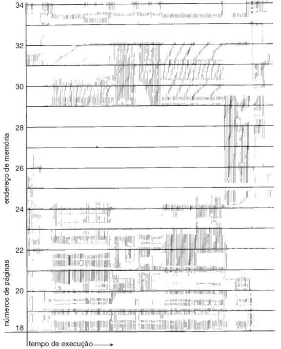
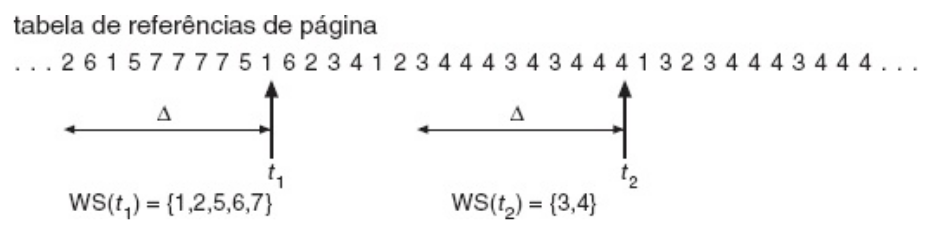
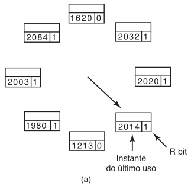
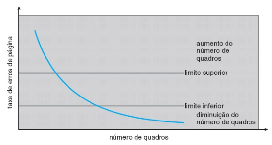

# -*- coding: utf-8 -*-
# -*- mode: org -*-
#+startup: beamer overview indent
#+LANGUAGE: pt-br
#+TAGS: noexport(n)
#+EXPORT_EXCLUDE_TAGS: noexport
#+EXPORT_SELECT_TAGS: export

#+Title: Sistemas Operacionais
#+Subtitle: Alocação de Quadros e Thrashing
#+Author: Prof. Lucas Mello Schnorr (UFRGS)
#+Date: \copyleft

#+LaTeX_CLASS: beamer
#+LaTeX_CLASS_OPTIONS: [xcolor=dvipsnames,10pt]
#+OPTIONS: H:1 num:t toc:nil \n:nil @:t ::t |:t ^:t -:t f:t *:t <:t
#+LATEX_HEADER: \input{org-babel.tex}

* Estrutura da aula

- Número mínimo de quadros por processo
- Algoritmos de alocação de quadros
  - Alocação igualitária
  - Alocação proporcional
  - Alocação por prioridade
  - Alocação global versus local
- Thrashing (Ultrapaginação)
  - Conceito e causas
  - Efeito sobre o uso de CPU
- Mecanismos para controlar /Thrashing/
  - Modelo do conjunto de trabalho
    - Janela do conjunto de trabalho
    - Aproximando o conjunto de trabalho
  - Algoritmo WSClock (Tanenbaum)
  - Frequência de falta de página como critério
  - Controle de carga

* Número Mínimo de Quadros por Processo

- Alocar quadros a processos exige respeitar um mínimo absoluto
- Abaixo do mínimo: taxa de erros de página cresce, execução trava
- Instrução interrompida por falta de página deve ser reiniciada
- Logo, todos os quadros que uma instrução referencia devem estar presentes

#+latex: \vfill

- Número mínimo definido pela arquitetura do computador
  - Instrução pode referenciar múltiplas páginas de operandos
  - Endereçamento indireto aumenta o número de páginas necessárias
  - PDP-11: até 6 quadros por instrução com dois operandos indiretos
  - IBM 370 MVC: até 6 quadros; com EXECUTE cruzando página: 8

#+latex: \vfill

- Número máximo definido pela memória física disponível
- Entre o mínimo e o máximo existe espaço de escolha para a política

* Alocação Igualitária

- Forma mais simples: dividir m quadros entre n processos igualmente
  - Cada processo recebe m/n quadros
  - Quadros restantes vão para um pool de buffers livres

#+latex: \vfill

- Exemplo: 93 quadros livres e 5 processos
  - Cada processo recebe 18 quadros
  - 3 quadros restantes ficam no pool de quadros livres

#+latex: \vfill

- Limitação: ignora diferenças de tamanho entre processos
  - Processo de 10 páginas recebe os mesmos quadros que um de 300 páginas
  - Quadros excedentes para processos pequenos ficam literalmente ociosos

* Alocação Proporcional

- Alocar quadros em proporção ao tamanho do espaço de endereçamento
  - s_{i}: tamanho do processo p_{i}; S = \sum s_{i}; m: total de quadros
  - Quadros alocados ao processo p_{i}: a_{i} \approx (s_{i} / S) \times m

#+latex: \vfill

- Exemplo: 62 quadros, processo de 10 páginas e de 127 páginas
  - S = 137; a_{1} = 10/137 \times 62 \approx 4 quadros
  - a_{2} = 127/137 \times 62 \approx 57 quadros

#+latex: \vfill

- Alocação varia com o grau de multiprogramação
  - Novo processo entra: todos os existentes cedem quadros
  - Processo termina: seus quadros são redistribuídos

#+latex: \vfill

- Variante por prioridade: proporção baseada em prioridade, não tamanho
  - Processo de alta prioridade recebe mais quadros para rodar mais rápido

* Alocação Global versus Local

- De qual processo retirar quadros ao substituir uma página?

#+latex: \vfill

** Alocação local
- Cada processo substitui apenas entre seus próprios quadros alocados
- Número de quadros por processo permanece fixo
- Processo controla sua própria taxa de faltas de página
- Desvantagem: pode não usar quadros ociosos de outros processos

** Alocação global
- Processo pode retirar quadros de qualquer outro processo
- Número de quadros por processo varia dinamicamente
- Taxa de faltas de página do processo depende de outros processos
- Vantagem: maior throughput geral; método mais usado na prática
  
#+latex: \vfill

# - Conjunto de trabalho e WSClock aplicam-se por processo (local)
#   - Não existe "conjunto de trabalho da máquina inteira"

* Thrashing: Conceito e Causas

- Processo sem quadros suficientes para páginas ativas gera faltas
  - Substitui uma página que será necessária imediatamente após
  - A falta ocorre de novo, e de novo, e de novo — ciclo sem fim

#+latex: \vfill

- Thrashing: processo gasta mais tempo paginando do que executando
- Localidade: processo usa ativamente apenas um subconjunto de páginas
  - Cada fase de execução possui sua localidade de referência
  - Thrashing ocorre quando quadros alocados < tamanho da localidade atual

#+latex: \vfill\pause

- Pré-paginação: carregar conjunto de trabalho antes de retomar processo
  - Evita rajada de faltas de página ao reiniciar execução
  - Modelo do conjunto de trabalho formaliza essa ideia

* Thrashing: Efeito sobre o Uso de CPU

- Utilização da CPU cai → scheduler aumenta multiprogramação
  - Novo processo retira quadros dos processos em execução
  - Mais processos geram mais faltas de página

#+latex: \vfill

- Fila de espera pelo dispositivo de paginação cresce
  - Fila de prontos se esvazia; utilização da CPU cai ainda mais
  - Scheduler responde aumentando novamente a multiprogramação
  - Sistema entra em colapso: throughput despenca

#+latex: \vfill\pause

- Curva utilização × multiprogramação mostra ponto de inflexão
  - Antes do pico: mais processos aumentam utilização da CPU
  - Após o pico: thrashing reduz utilização abruptamente
  - *Atividade Improdutiva* ocorre após o pico, devemos evitá-la

#+latex: \vfill\pause

- Substituição local atenua o thrashing de um processo
  - Processo em thrashing não rouba quadros de outros processos
  - Porém, aumenta o tempo médio de atendimento de falta de página
- Estratégia conhecida pelo "Conjunto de Trabalho"

* Modelo do Conjunto de Trabalho 1/2

- Baseado no princípio da localidade de referência
- Conjunto de trabalho: páginas em uso ativo em dado momento

#+attr_latex: :width .4\linewidth

Se não alocarmos quadros suficientes para acomodar o tamanho da
localidade corrente, o processo entrará em *atividade improdutiva*, já
que não pode manter na memória todas as páginas que está usando
ativamente.

* Modelo do Conjunto de Trabalho 2/2

- Def. formal: w(\Delta,t) = páginas das \Delta refs. mais recentes no instante t
  - Função monotonicamente não decrescente com \Delta
  - Converge para um limite finito (programa não usa todas as páginas)

#+attr_latex: :width .8\linewidth

#+latex: \pause

- Parâmetro \Delta: tamanho da janela móvel do conjunto de trabalho
  - Conjunto de trabalho = páginas usadas nas últimas \Delta referências
  - Página entra no conjunto ao ser referenciada
  - Página sai do conjunto \Delta unidades após sua última referência

#+latex: \vfill

- Escolha de \Delta afeta a qualidade da aproximação da localidade
  - \Delta pequeno: não captura toda a localidade corrente
  - \Delta grande: pode englobar múltiplas localidades distintas
  - \Delta = \infty: conjunto inclui todas as páginas já referenciadas

#+latex: \vfill

- Janela do conjunto de trabalho é uma janela móvel sobre referências
  - A cada referência: nova referência entra, referência mais velha sai
  - Página permanece no conjunto enquanto estiver dentro da janela

* Evitando Thrashing com o Conjunto de Trabalho

- Demanda total de quadros: D = \sum WSS_{i}
  - WSS_{i}: tamanho do conjunto de trabalho do processo i
    - WSS é /Working Set Size/
  - D > m (quadros disponíveis) \rightarrow thrashing iminente

#+latex: \vfill\pause

** Estratégia: alocar WSS_{i} quadros a cada processo
- Se sobram quadros, iniciar novo processo
- Se D > m, suspender um processo e redistribuir seus quadros
  - Otimiza a utilização da CPU

* Aproximando o Conjunto de Trabalho

- Manter janela exata é caro (registro de cada referência individual)
  - Abandonamos a ideia de rastrear as \Delta refs. mais recentes
- Aproximação prática
  - Usar o tempo virtual como janela do conjunto de trabalho
  - Exemplo: usar os últimos 100ms do tempo de execução _individual_
    - Ou seja, os últimos \tau = 100ms de tempo virtual
    
#+latex: \pause
  
** Algoritmo do Conjunto de Trabalho (Tanenbaum)

- Tabela de páginas contém: 1/ bit de referência e 2/ instante do último uso
- A cada falta de página, varrer toda a tabela de páginas:
  - R == 1: atualizar instante do último uso para o tempo virtual atual
  - R == 0 e idade > \tau: remover esta página (não está no conjunto)
  - R == 0 e idade \le \tau: manter; registrar página com menor instante

#+latex: \vfill

- Se varredura completa não encontrar candidata: todas no conjunto
  - Remover a página R == 0 com maior idade
  - Se todas com R == 1: escolher ao acaso, preferindo página limpa

#+latex: \vfill

- Desvantagem: varredura completa da tabela a cada falta é cara

* Algoritmo WSClock

- Melhoria do conjunto de trabalho baseada no algoritmo do relógio
  - Evita varrer a tabela de páginas inteira
- Lista circular de quadros; ponteiro avança a cada falta de página
 - Cada entrada:  1/ bit de referência e 2/ instante do último uso

#+attr_latex: :width .3\linewidth  

#+latex: \vfill\pause

- Página apontada com R == 1: zerar R, avançar ponteiro, continuar
- Página apontada com R == 0:
  - Idade > \tau e página limpa: reivindicar quadro imediatamente
  - Idade > \tau e página suja: escalonar escrita em disco, avançar
  - Idade \le \tau: página ainda no conjunto de trabalho, avançar ponteiro

#+latex: \vfill\pause

- Se ponteiro completar volta completa:
  - Alguma escrita escalonada: procurar primeira página limpa disponível
  - Nenhuma escrita escalonada: todas no conjunto de trabalho;
    usar qualquer página limpa encontrada ou substituir a atual

* Frequência de Falta de Página como Critério

- Abordagem direta: controlar thrashing pela taxa de faltas de página
- Taxa de faltas do processo indica se quadros estão adequados
  - Page-Fault Frequency (PFF)

#+attr_latex: :width .55\linewidth  

#+latex: \vfill

- Definir limites superior e inferior para a taxa de faltas aceitável
  - Taxa > limite superior: processo precisa de mais quadros → alocar
  - Taxa < limite inferior: processo tem quadros em excesso → remover

#+latex: \vfill

- Medição: contar faltas por segundo; suavizar com média temporal
- Taxa de faltas tende a cair quando mais quadros são alocados
  - Válido para LRU e a maioria dos algoritmos práticos (PFF)

#+latex: \vfill

- Se taxa sobe e não há quadros livres: suspender um processo
  - Liberar seus quadros e redistribuir aos processos com alta taxa

* Controle de Carga

- Thrashing surge se os conjuntos de trabalho combinados excedem a mem.
  - Conjunto de Trabalho parece simplista para controlar a ativ. improdutiva
- PFF indica que alguns processos precisam de mais memória
  - Mas nenhum processo precisa de menos memória ;(
  
#+attr_latex: :width .35\linewidth  

  
#+latex: \vfill\pause

- Solução: reduzir o número de processos competindo pela memória
  - Suspender um processo e transferi-lo para o disco
  - Redistribuir seus quadros entre os processos remanescentes
    - Se thrashing persistir, suspender mais um processo

#+latex: \vfill

- Reminiscente do escalonamento de dois níveis
  - Escalonador de curto prazo: gerencia processos na memória
  - Escalonador de médio prazo: troca processos entre memória e disco

#+latex: \vfill

- Ao decidir qual processo suspender, considerar também:
  - Grau de multiprogramação (CPU não deve ficar ociosa)
  - Tipo do processo: limitado por CPU ou por E/S

* Referências

- Silberchatz
  - Cap. 9, Sec. 9.5 (Alocação de Quadros)
  - Cap. 9, Sec. 9.6 (Thrashing e Conjunto de Trabalho)
- Tanenbaum
  - Cap. 3, Sec. 3.4.8 (Algoritmo do Conjunto de Trabalho)
  - Cap. 3, Sec. 3.4.9 (WSClock)
  - Cap. 3, Sec. 3.5.1 (Alocação Local versus Global)
  - Cap. 3, Sec. 3.5.2 (Controle de Carga)
