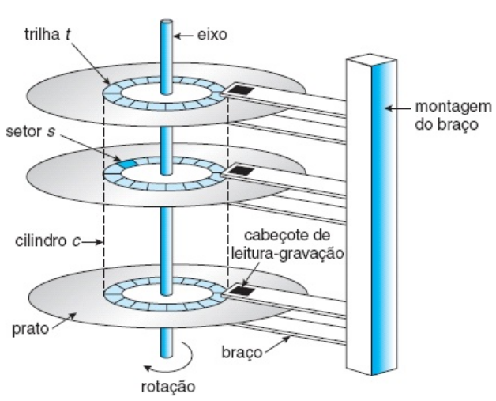
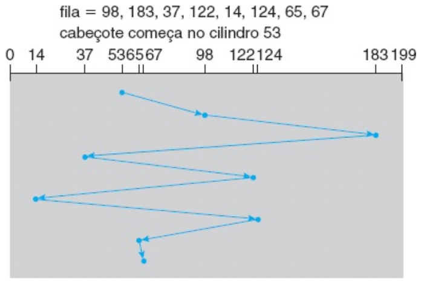
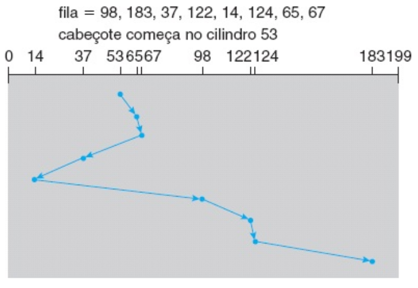
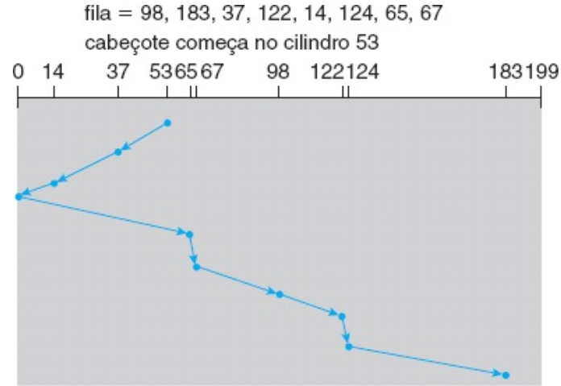
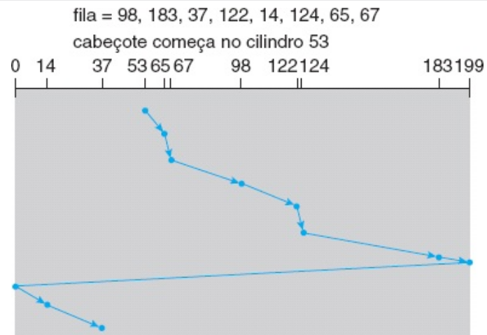
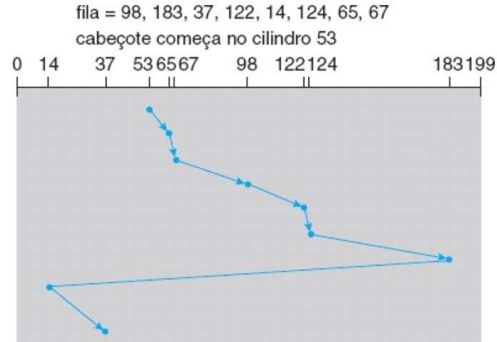

# -*- coding: utf-8 -*-
# -*- mode: org -*-
#+startup: beamer overview indent
#+LANGUAGE: pt-br
#+TAGS: noexport(n)
#+EXPORT_EXCLUDE_TAGS: noexport
#+EXPORT_SELECT_TAGS: export

#+Title: Sistemas Operacionais
#+Subtitle: Gerência de Disco
#+Author: Prof. Lucas Mello Schnorr (UFRGS)
#+Date: \copyleft

#+LaTeX_CLASS: beamer
#+LaTeX_CLASS_OPTIONS: [xcolor=dvipsnames,10pt]
#+OPTIONS: H:1 num:t toc:nil \n:nil @:t ::t |:t ^:t -:t f:t *:t <:t
#+LATEX_HEADER: \input{org-babel.tex}

* Estrutura da aula

- Disco Magnético: Estrutura Física
  - Prato, trilha, setor, cilindro
  - Cabeça de leitura/escrita e braço do disco
  - Velocidade de rotação (RPM)
- Desempenho do Disco
  - Tempo de busca, latência rotacional, tempo de transferência
- Escalonamento de Disco
  - FCFS — primeiro a chegar, primeiro a ser atendido
  - SSTF — menor tempo de busca primeiro
  - SCAN — algoritmo do elevador
  - C-SCAN — varredura circular
  - LOOK e C-LOOK
- Discos de Estado Sólido (SSD)
- Formatação de Disco e Particionamento
- RAID: motivação, confiabilidade e níveis

* Disco Magnético: Estrutura Física 1/2

Disco magnético fornece grande parte do armazenamento secundário

- Prato: superfície circular coberta por material magnético
  - Dados armazenados magneticamente na superfície do prato
- Superfície dividida em trilhas circulares concêntricas
  - Trilhas subdivididas em setores (unidade mínima de transferência)
- Cilindro: conjunto de trilhas na mesma posição do braço
  - Discos modernos têm dezenas de milhares de cilindros

#+attr_latex: :width .5\linewidth

#+latex: \vfill

* Disco Magnético: Estrutura Física 1/2

- Cabeça de leitura/escrita flutua sobre a superfície do prato
  - Cabeças fixadas ao braço do disco; movem-se todas juntas
- Disco rígido: múltiplos pratos empilhados, uma cabeça por superfície
- Velocidade medida em RPM: 5.400, 7.200, 10.000, 15.000 RPM

#+attr_latex: :width .7\linewidth

* Desempenho do Disco

Tempo de acesso randômico composto por duas parcelas:

- Tempo de busca: mover o braço até o cilindro desejado
  - Componente dominante — varia de 3 a 15 ms em discos modernos
- Latência rotacional: esperar o setor girar até a cabeça
  - Em 7.200 RPM: rotação completa em 8,3 ms; latência média ≈ 4,2 ms

#+latex: \vfill

- Tempo de transferência: taxa em que dados fluem entre disco e memória
  - Discos modernos transferem centenas de MB/s
- Largura de banda: total de bytes transferidos / tempo total do acesso

#+latex: \vfill

- Para a maioria dos discos, tempo de busca domina os demais
  - Reduzir a distância média de busca melhora o desempenho

* Escalonamento de Disco: Motivação

Em sistema multiprogramado, vários processos emitem requisições ao disco

- Fila de requisições: cilindros 98, 183, 37, 122, 14, 124, 65, 67
  - Cabeça inicialmente no cilindro 53
- O SO seleciona qual requisição atender em seguida

#+latex: \vfill

- Objetivo: minimizar o movimento total da cabeça (tempo de busca)
- Cada requisição especifica: direção (leitura/escrita), endereço de
  disco, endereço de memória, número de setores a transferir

#+latex: \vfill

- Algoritmos de escalonamento diferem na ordem de atendimento
  - Impacto direto no desempenho e na equidade entre processos

* Escalonamento FCFS

FCFS: primeiro a chegar, primeiro a ser atendido

- Algoritmo intrinsecamente justo; simples de implementar
- Ordem de atendimento: 98, 183, 37, 122, 14, 124, 65, 67
  - Partindo do cilindro 53 → movimento total de 640 cilindros

#+attr_latex: :width .5\linewidth

#+latex: \vfill

- Problema: mudanças bruscas de direção degradam o desempenho
  - Cilindro 122 → 14 → 124: retrocede e avança desnecessariamente
- Com fila longa, o FCFS ignora a proximidade entre requisições
  - Requisições próximas à cabeça não têm prioridade

#+latex: \vfill

- FCFS é adequado quando a fila tem geralmente apenas uma requisição
  - Com fila vazia, todos os algoritmos se comportam como FCFS

* Escalonamento SSTF

SSTF: menor tempo de busca primeiro (Shortest Seek Time First)

- Seleciona a requisição pendente mais próxima da posição atual
- Exemplo: de 53 → 65, 67, 37, 14, 98, 122, 124, 183
  - Movimento total: 236 cilindros (≈ 1/3 do FCFS)

#+attr_latex: :width .5\linewidth

#+latex: \vfill

- Análogo ao escalonamento SJF de processos

#+latex: \vfill

- Problema: pode causar inanição de requisições distantes
  - Fluxo contínuo de requisições próximas pode bloquear cilindros
    distantes indefinidamente
- SSTF não é ótimo: há ordenações com desempenho ainda melhor
  - Exemplo: 53 → 37, 14, 65, 67, 98, 122, 124, 183 = 208 cilindros

* Escalonamento SCAN

SCAN: braço varre o disco de uma extremidade à outra

- Atende requisições conforme alcança cada cilindro
- Ao chegar à extremidade, inverte a direção e repete a varredura

#+latex: \vfill

- Exemplo (movendo em direção ao cilindro 0, partindo de 53):
  - Atende 37, 14 → chega ao cilindro 0 → inverte
  - Atende 65, 67, 98, 122, 124, 183

#+attr_latex: :width .5\linewidth

#+latex: \vfill

- Vantagem: sem inanição; todas as requisições são atendidas
- Problema: requisição que acaba de passar pela cabeça espera
  um ciclo completo até ser atendida novamente
- Carga não uniforme: cilindros centrais são mais atendidos

* Escalonamento C-SCAN (Circular SCAN)

- Variante do SCAN com tempo de espera mais uniforme
- Move a cabeça de uma extremidade à outra atendendo requisições
- Ao atingir o fim, retorna imediatamente ao início sem atender
  - Trata os cilindros como uma lista circular
  
#+latex: \vfill

- Garante tempo de espera mais uniforme do que o SCAN
  - Evita o favorecimento dos cilindros do meio

#+latex: \vfill

- Exemplo (partindo de 53, movendo em direção ao cilindro 199):
  - Atende 65, 67, 98, 122, 124, 183, 199 → retorna ao 0
  - Atende 14, 37 na próxima passagem

#+attr_latex: :width .5\linewidth

* Algoritmos LOOK e C-LOOK, variantes do SCAN, C-SCAN

LOOK: variante do SCAN

- Braço vai apenas até o local da última requisição em cada direção
  - Inverte imediatamente, sem alcançar a extremidade do disco
- Evita movimento desnecessário além da última requisição

#+latex: \vfill

C-LOOK: variante do C-SCAN sem percorrer todo o disco

- Ao atender a última requisição em uma direção, retorna à
  primeira requisição pendente no sentido oposto
- Não percorre os cilindros entre a última requisição e a borda

#+attr_latex: :width .5\linewidth

#+latex: \vfill

- LOOK e C-LOOK são as implementações práticas mais comuns
  - SCAN e C-SCAN raramente implementados em sua forma pura
# - O algoritmo do elevador em prédios usa lógica equivalente ao LOOK

* Seleção do Algoritmo de Escalonamento

Nenhum algoritmo é ótimo em todas as situações

- FCFS: justo, simples, mas ineficiente com filas longas
- SSTF: melhora o desempenho médio, porém pode causar inanição
- SCAN/LOOK: sem inanição; melhor sob carga pesada
- C-SCAN/C-LOOK: tempo de espera mais uniforme que SCAN

#+latex: \vfill

- Desempenho depende do número e tipo de requisições
  - Fila com uma requisição: todos os algoritmos equivalem ao FCFS
- Método de alocação de arquivos influencia o padrão de requisições
  - Arquivo contíguo: requisições próximas → pouco movimento
  - Arquivo encadeado ou indexado: requisições espalhadas → mais movimento

#+latex: \vfill

- Algoritmo deve ser módulo separado do SO — substituível
  - SSTF e LOOK são opções aceitáveis como algoritmo padrão

* Discos de Estado Sólido (SSD)

SSD: memória não volátil usada como unidade de armazenamento

- Sem partes mecânicas em movimento
  - Sem braço, sem pratos giratórios, sem cabeça de leitura/escrita
- Tecnologias: memória flash SLC (célula de um nível) e MLC

#+latex: \vfill

- Vantagens em relação ao disco magnético:
  - Sem tempo de busca e sem latência rotacional
  - Maior velocidade de acesso (leituras especialmente rápidas)
  - Menor consumo de energia; maior robustez a impactos

#+latex: \vfill

- Desvantagens:
  - Custo mais elevado por gigabyte
  - Capacidade máxima menor do que grandes discos magnéticos
  - Vida útil limitada pelo número de ciclos de escrita por célula
- Escalonamento de disco quase não se aplica a SSDs
  - Linux usa política FCFS com mesclagem de requisições adjacentes

* Formatação de Disco: Baixo Nível

Disco novo é apenas material magnético bruto sem estrutura

- Formatação de baixo nível (formatação física) divide o disco em setores
  - Permite que o controlador leia e grave setores individualmente

#+latex: \vfill

- Estrutura de cada setor:
  - Cabeçalho: número de cilindro, número de setor, sincronização
  - Área de dados: geralmente 512 bytes
  - Trailer: código de correção de erros (ECC)
- ECC permite detectar e corrigir erros de leitura automaticamente

#+latex: \vfill

- Setores sobressalentes reservados para substituir setores defeituosos
  - Fabricante mapeia blocos lógicos para setores físicos sem defeito
- Deslocamento de cilindro: setor 0 de trilhas consecutivas é deslocado
  - Melhora leitura contínua entre trilhas ao compensar o tempo de busca

* Particionamento e Formatação Lógica

Após a formatação física, o disco precisa de estrutura lógica

- Particionamento: dividir o disco em grupos de cilindros
  - Cada partição tratada pelo SO como um disco independente
  - Setor 0 contém o MBR (Master Boot Record) com tabela de partições
  - MBR suporta discos até 2 TB; GPT suporta até 9,4 ZB

#+latex: \vfill

- Formatação lógica (criação do sistema de arquivos):
  - SO grava estruturas iniciais: mapa de espaço livre, diretório raiz
  - Define o tipo do sistema de arquivos na tabela de partições

#+latex: \vfill

- Agrupamento em clusters: blocos agrupados para reduzir E/S aleatória
  - E/S de sistema de arquivos em clusters; E/S de disco em blocos
- Disco bruto: partição sem sistema de arquivos
  - Bancos de dados podem usar disco bruto para controle direto

* RAID: Motivação e Confiabilidade

Arrays de discos independentes e redundantes (RAID)

- Com N discos, a chance de algum disco falhar é N vezes maior
  - 100 discos com MTTF 100.000 h → MTTF do array ≈ 1.000 h (41 dias)

#+latex: \vfill

- Solução: introduzir redundância para tolerar falhas de disco
  - Espelhamento: cada disco duplicado; toda gravação feita nos dois
  - Se um disco falha, dados lidos do espelho
  - MTTF com espelhamento: ≈ 57.000 anos (com reparo em 10 h)

#+latex: \vfill

- Distribuição de dados (striping): dados divididos entre múltiplos discos
  - Distribuição no nível de bloco: bloco i vai para disco (i mod N) + 1
  - Aumenta o throughput de leituras e gravações simultâneas
- RAID combina redundância e distribuição para desempenho e confiabilidade

* Níveis de RAID

Níveis de RAID diferem em desempenho, custo e confiabilidade

- RAID 0: distribuição em blocos, sem redundância
  - Alto desempenho; perda total de dados se um disco falhar
  - Uso: aplicações de alto desempenho onde perda é tolerável

#+latex: \vfill

- RAID 1: espelhamento completo
  - Alta confiabilidade e recuperação rápida; custo: dobra o espaço
  - Uso: aplicações que exigem alta disponibilidade

#+latex: \vfill

- RAID 5: distribuição com paridade distribuída entre N+1 discos
  - Paridade espalhada por todos os discos (não há disco dedicado)
  - Tolera falha de um disco; reconstrução a partir dos demais
  - Uso: armazenamento de grandes volumes de dados
- RAID 0+1 / 1+0: combinação de distribuição e espelhamento
  - Desempenho do RAID 0 com confiabilidade do RAID 1

* Referências

- Silberchatz
  - Cap. 10, Secs. 10.1, 10.2, 10.4, 10.7
- Tanenbaum
  - Cap. 5, Secs. 5.1.1, 5.1.2, 5.1.3, 5.4.1, 5.4.2, 5.4.3
