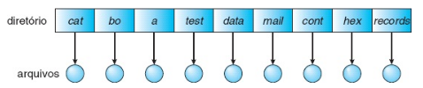
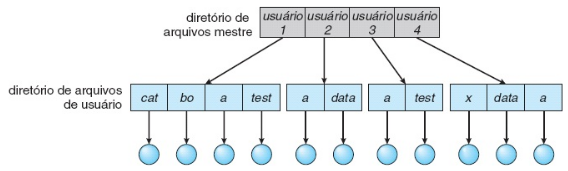
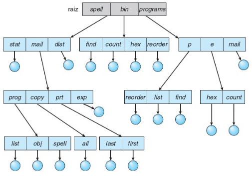
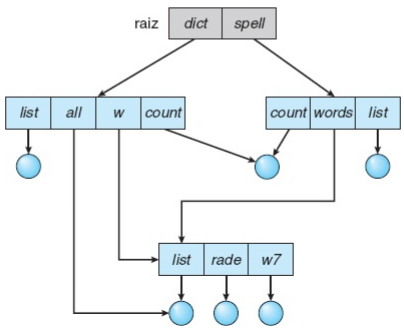
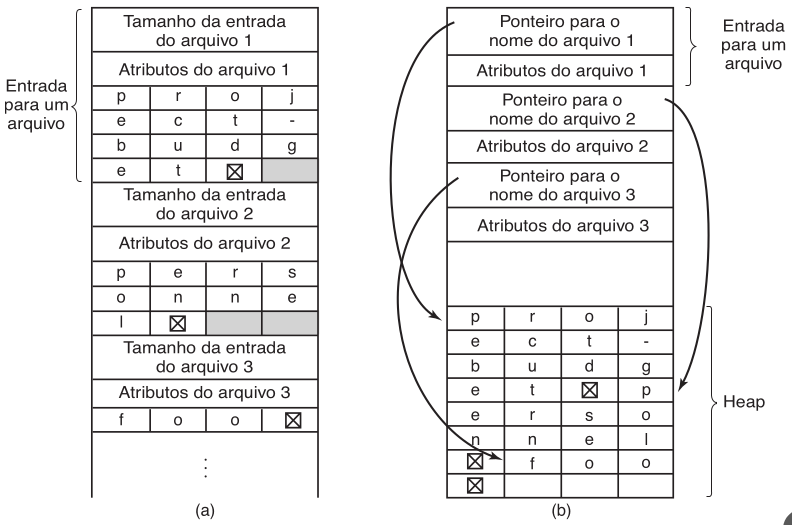
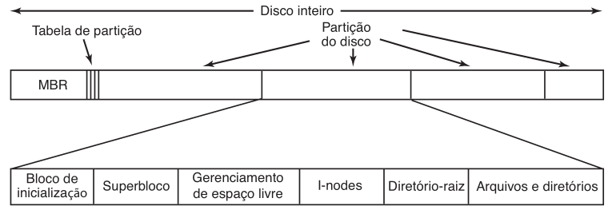
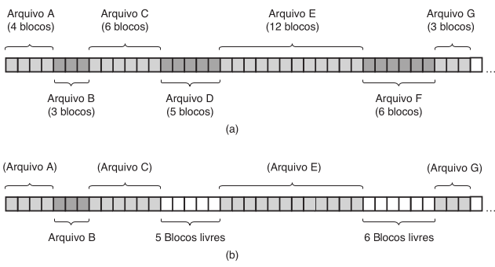
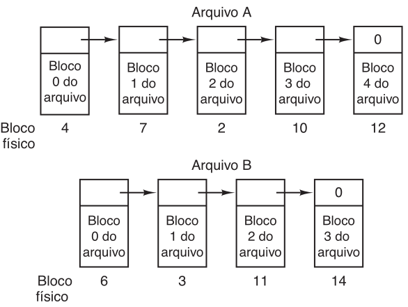
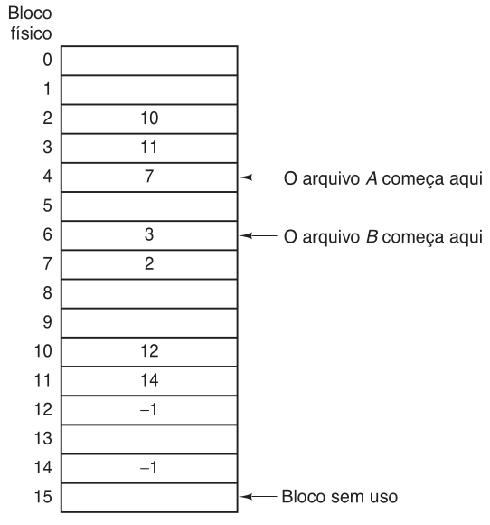
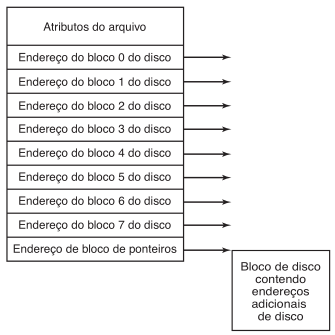

# -*- coding: utf-8 -*-
# -*- mode: org -*-
#+startup: beamer overview indent
#+LANGUAGE: pt-br
#+TAGS: noexport(n)
#+EXPORT_EXCLUDE_TAGS: noexport
#+EXPORT_SELECT_TAGS: export

#+Title: Diretórios, Links e Métodos de Alocação
#+Author: Prof. Lucas Mello Schnorr
#+Date: \copyleft

#+LaTeX_CLASS: beamer
#+LaTeX_CLASS_OPTIONS: [xcolor=dvipsnames,10pt]
#+OPTIONS: H:1 num:t toc:nil \n:nil @:t ::t |:t ^:t -:t f:t *:t <:t
#+LATEX_HEADER: \input{org-babel.tex}

* Estrutura da aula

- Diretórios
  - Estrutura
  - Implementação
- Links e compartilhamento
- Sistema de arquivos
  - Organização
  - Métodos de alocação de espaço em disco

* Propósito e Operações de Diretório

** Diretório
- Tabela de símbolos que mapeia nomes de arquivos para onde está o arquivo
- Organização deve permitir: inserir, excluir, buscar, listar

** Principal função de diretórios
- Mapear nome em ASCII para dado no disco
  - Endereço de disco, número do primeiro bloco, ou i-node

** Operações sobre diretório

- Busca de arquivo: encontrar a entrada pelo nome (ou padrão)
- Criação de arquivo: adicionar nova entrada ao diretório
- Exclusão de arquivo: remover a entrada e liberar espaço
- Listagem de diretório: exibir arquivos e seus atributos
- Renomeação de arquivo: alterar nome (e posição na estrutura)
- Varredura no sistema de arquivos: percorrer toda a árvore

* Diretório de Nível Único

Estrutura mais simples: todos os arquivos em um único diretório

#+attr_latex: :width .65\linewidth

#+latex: \vfill

** Vantagens
- Fácil de implementar e entender
- Sem hierarquia a gerenciar

** Limitações
- Todos os nomes de arquivo devem ser globalmente exclusivos
- Colisão inevitável com múltiplos usuários
  - Exemplo: 23 alunos chamam o arquivo de prog2.c
- Difícil de gerenciar com centenas ou milhares de arquivos

#+latex: \vfill

- Suporte a nomes com até 255 caracteres ajuda, mas não resolve
- Impraticável em sistemas multiusuário

* Diretório de Dois Níveis

Solução: criar diretório separado para cada usuário

#+attr_latex: :width .65\linewidth

#+latex: \vfill

** Componentes

- MFD (Master File Directory): indexado por nome de usuário
  - Cada entrada aponta para o UFD do usuário
- UFD (User File Directory): lista os arquivos de um usuário
  - Nomes exclusivos apenas dentro do UFD

#+latex: \vfill

** Características

- Diferentes usuários podem ter arquivos com o mesmo nome
- Acesso a arquivo próprio: test.txt
- Acesso a arquivo de outro usuário: /userb/test.txt
- Isolamento entre usuários (vantagem e desvantagem)

* Diretório em Árvore

Generalização natural: árvore de altura arbitrária

- Raiz única; cada arquivo tem nome de caminho exclusivo
- Usuários criam subdiretórios para organizar seus arquivos
- Cada processo possui um diretório corrente

#+attr_latex: :width .35\linewidth

#+latex: \vfill

** Tipos de caminho
- Absoluto (/home/joao/prog/main.c) ou relativo (prog/main.c)

#+latex: \vfill

** Exclusão de diretório
- Diretório vazio: remove entrada no diretório pai
- Diretório não vazio — duas políticas:
  - Recusar exclusão até vazio OU Remover recursivamente

* Diretório em Grafo Acíclico 1/2

Motivação: dois programadores compartilham subdiretório de projeto

- Árvore proíbe compartilhamento; grafo acíclico permite
- Um arquivo ou diretório existe em dois ou mais locais
- Não é cópia: alteração visível a todos os usuários

#+latex: \vfill\pause

#+attr_latex: :width .65\linewidth

* Diretório em Grafo Acíclico 2/2
** Implementações de compartilhamento

- +Duplicação de entrada: cópias idênticas nos dois diretórios+
  - Problema de consistência ao modificar
- Link simbólico: entrada com nome de caminho do alvo
  - SO resolve o caminho ao abrir o arquivo

#+latex: \pause

** Problema com exclusão

- Remover arquivo deixa ponteiros pendentes
- Solução: contagem de referências no i-node
  - Arquivo excluído quando contagem chega a zero

#+latex: \pause

** Left                                                              :BMCOL:
:PROPERTIES:
:BEAMER_col: 0.48
:END:

*** Contagem de referências

- Criar link: incrementa contador
- Remover link: decrementa contador
- Contador = 0: arquivo excluído

#+latex: \pause

** Right                                                             :BMCOL:
:PROPERTIES:
:BEAMER_col: 0.48
:END:

*** Grafo acíclico no UNIX

- Hard links usam contagem no i-node
- Proibir links para diretórios
  - Garante estrutura acíclica

* Grafo Geral de Diretórios

Links adicionados a uma árvore podem criar ciclos

- Estrutura resultante: grafo geral (não mais acíclico)
- Exemplo: link de subdiretório apontando para ancestral

#+latex: \vfill

** Problemas com ciclos
- Algoritmos de percurso podem entrar em loop infinito
  - Solução: limitar número de diretórios visitados
- Contagem de referências pode ser incorreta com ciclos
  - Autorreferência mantém contador positivo mesmo sem usuários

#+latex: \vfill

** Coleta de lixo (garbage collection)
- Varredura completa do sistema de arquivos marcando acessíveis
- Segunda passagem libera tudo que não está marcado
- Muito custosa em disco; raramente executada

#+latex: \vfill

- Preferível: evitar ciclos ao criar novos links
  - Ignorar links durante travessias de diretório

* Implementação de Diretório: Lista Linear

** Método mais simples de implementação

Lista de entradas (nome + ponteiro para dados)

** Operações
- Criar: buscar nome duplicado; adicionar entrada ao final
- Excluir: buscar entrada; marcar livre ou compactar lista
- Buscar: percorrer linearmente do início ao fim

#+latex: \vfill

** Desempenho
- Busca linear: O(n) \to lenta para diretórios grandes
- Muitos SOs usam cache de diretório (entradas recentes)
- Lista ordenada: permite busca binária O(log n)
  - Complica inserção e exclusão (manter ordem)
- Árvore balanceada: insere e busca em O(log n)

* Implementação de Diretório: Tabela de Dispersão
** Método mais sofisticado

Lista linear + tabela hash para acelerar buscas
- Hash do nome de arquivo → índice na tabela
- Tabela aponta para entrada na lista linear

#+latex: \vfill

** Vantagens
- Busca muito mais rápida do que a linear
- Inserção e exclusão também mais eficientes
** Desvantagens
- Colisões: dois nomes mapeados para o mesmo índice
  - Tratamento: lista encadeada de entradas colidentes
- Redimensionar exige recalcular todos os hashes

#+latex: \vfill\pause

** Vale a pena?

- Recomendada apenas se diretório tem muitos arquivos
- Cache de buscas: guarda resultados recentes em memória
  - Eficaz quando poucos arquivos são acessados

* Conteúdo das Entradas de Diretório 1/2

Questão de projeto: onde armazenar os atributos do arquivo?

#+latex: \vfill\pause

** Opção A — atributos na entrada de diretório
- Entrada: nome fixo + atributos + endereços de disco
- Usado em FAT (MS-DOS/Windows)
- Simples; atributos sempre acessíveis com o nome
** Opção B — atributos no i-node (UNIX/Linux)
- Entrada curta: nome + número de i-node
- Atributos e blocos ficam no i-node
- Vantagem: suporta ligações rígidas com facilidade
#+latex: \vfill\pause
* Conteúdo das Entradas de Diretório 2/2
** Nomes de tamanho variável
- Abordagem sequencial
  - Entrada com tamanho variável
  - Nome termina com byte nulo
  - Alinhado em múltiplo de palavra
- Abordagem com heap
  - Entrada fixa com ponteiro para heap
  - Nomes armazenados em área separada
  - Remoção não deixa lacuna no heap

#+attr_latex: :width .65\linewidth

* Ligações Rígidas (Hard Links)

Ligação rígida: nova entrada de diretório apontando
para o mesmo i-node de um arquivo existente

- Dois (ou mais) caminhos referenciam o mesmo arquivo
- Não há cópia: um único arquivo físico
- Contador de referências armazenado no i-node

#+latex: \vfill

** Semântica de exclusão
- Remover um link: decrementa contador no i-node
- Arquivo excluído apenas quando contador chega a zero
- Proprietário original pode remover seu link: arquivo persiste
  enquanto outros links existirem

#+latex: \vfill

** Restrições típicas
- Ligações rígidas para diretórios geralmente proibidas
  - Evita ciclos no grafo de diretórios
- Ligações rígidas restritas ao mesmo sistema de arquivos
  - I-nodes são locais a uma partição

#+latex: \vfill

Exemplo: =ln arquivo.txt link_rigido.txt=

* Ligações Simbólicas (Soft Links)

Ligação simbólica: arquivo especial do tipo LINK
contendo o nome de caminho do arquivo alvo

- SO detecta tipo LINK ao abrir; resolve o caminho
- Nível de indireção extra a cada acesso

#+latex: \vfill

** Vantagens
- Funciona entre diferentes sistemas de arquivos
- Pode referenciar arquivos em outras máquinas (NFS)
- Remover link não afeta o arquivo original

** Problemas
- Link pendente (dangling link): arquivo original excluído
  - Acesso subsequente falha com "arquivo não encontrado"
  - UNIX deixa links pendentes; cabe ao usuário perceber
- Sobrecarga extra: ler arquivo de link + resolver caminho
  - Cada componente do caminho exige acesso ao disco
- I-node extra necessário para cada ligação simbólica

#+latex: \vfill

Exemplo: =ln -s /home/joao/dados.txt link_simbolico.txt=

* Layout do Sistema de Arquivos em Disco
** Estrutura do disco inteiro

MBR (setor 0): tabela de partições + código de inicialização

#+attr_latex: :width .65\linewidth

** Estrutura típica de uma partição

#+latex: \vfill

| Região                   | Conteúdo                              |
|--------------------------+---------------------------------------|
| Bloco de inicialização   | Código para carregar o SO             |
| Superbloco               | Tipo, número de blocos, parâmetros    |
| Gerenciamento de livres  | Mapa de bits ou lista encadeada       |
| Região de i-nodes        | Um i-node por arquivo (atributos)     |
| Diretório raiz           | Topo da árvore do sistema de arquivos |
| Área de dados            | Arquivos e diretórios                 |

* More (to be reviewed)                                            :noexport:
#+latex: \vfill

- Superbloco: lido na memória ao montar o sistema de arquivos
  - Número mágico identifica o tipo do FS
- I-node: contém atributos + endereços dos blocos do arquivo
  - Carregado na memória apenas quando o arquivo está aberto

* Métodos de Alocação de Espaço em Disco

Principal problema: como alocar blocos em disco para arquivos

- Objetivo: eficiência de armazenamento e rapidez de acesso

#+latex: \vfill

Três métodos principais:

- Contíguo: arquivo ocupa blocos consecutivos no disco
  - Acesso direto e sequencial eficientes; simples de implementar
- Encadeado: arquivo é lista encadeada de blocos dispersos
  - Sem fragmentação externa; crescimento dinâmico
- Indexado: ponteiros reunidos em bloco de índices por arquivo
  - Acesso direto sem fragmentação externa

#+latex: \vfill

- Cada método tem vantagens e desvantagens distintas
- Sistemas de arquivos adotam geralmente um único método

* Alocação Contígua: Estrutura e Acesso

Cada arquivo ocupa conjunto de blocos consecutivos no disco

#+attr_latex: :width .5\linewidth

# - Arquivo definido por bloco inicial b e tamanho n
#   - Ocupa blocos b, b+1, b+2, …, b+n-1
# - Entrada de diretório armazena apenas b e n

#+latex: \vfill

** Acesso eficiente

- Sequencial: lê próximo bloco sem busca adicional no disco
- Direto ao bloco i: acessa bloco b+i imediatamente
  - Sem percorrer cadeia; fórmula simples
- Número mínimo de movimentos do cabeçote do disco

#+latex: \vfill

** Simples de implementar: apenas dois números por arquivo
- Leitura de arquivo inteiro em uma única operação contígua

* Alocação Contígua: Problemas e Extensões
** Dois problemas principais

- Fragmentação externa: alocações e liberações fragmentam o espaço
  - Espaço livre dividido em lacunas não contíguas
  - Compactação resolve mas pode levar horas em discos grandes
- Determinação do tamanho: tamanho final deve ser conhecido na criação
  - Subestimar impede extensão; superestimar causa fragmentação interna

#+latex: \vfill\pause

** Solução parcial: extensões

- Aloca porção contígua inicial; adiciona extensão se necessário
- Registro: endereço + contagem de blocos + link p/ próxima extensão
- Ainda sujeito a fragmentação interna e externa

#+latex: \vfill\pause

** Alocação contígua ainda usada em mídias óticas (CD-ROM, DVD)
- Tamanhos conhecidos antecipadamente; sem modificações

* Alocação Encadeada: Estrutura

Cada arquivo é lista encadeada de blocos de disco

#+attr_latex: :width .5\linewidth

- Blocos dispersos em qualquer posição no disco
- Cada bloco contém ponteiro para o próximo bloco
- Diretório armazena ponteiro para primeiro (e último) bloco

* Alocação Encadeada: Vantagens e Desvantagens
** Vantagens
- Sem fragmentação externa: qualquer bloco livre serve
- Tamanho do arquivo não precisa ser declarado na criação
- Arquivo cresce dinamicamente enquanto houver blocos livres
- Nunca é necessário compactar o disco

#+latex: \vfill

*Criação de arquivo*

- Nova entrada no diretório com ponteiro nulo (arquivo vazio)
- Gravação: sistema aloca bloco livre e encadeia ao fim da lista

#+latex: \vfill\pause

** Desvantagens

- Acesso direto ineficiente
  - Encontrar bloco i implica percorrer lista encadeada
    - Cada um requer leitura em disco
- Sobrecarga de ponteiros: 4 bytes por bloco de 512 bytes \approx0.78%
- Confiabilidade: ponteiro corrompido desencadeia em arquivo errado
  - Soluções: lista duplamente encadeada; nº de bloco em cada bloco

* Alocação Encadeada: FAT (File Allocation Table) 1/2

** Trata-se de uma variação da lista encadeada

Uma tabela que fica em RAM
- Reservada no início do volume
- Uma entrada por bloco
- Entrada contém número do próximo bloco (ou marcador EOF/livre)

** Left                                                              :BMCOL:
:PROPERTIES:
:BEAMER_col: 0.50
:END:

#+attr_latex: :width .8\linewidth

** Right                                                             :BMCOL:
:PROPERTIES:
:BEAMER_col: 0.5
:END:

#+attr_latex: :width .7\linewidth

* Alocação Encadeada: FAT (File Allocation Table) 2/2
** Tabela em RAM, os dados no disco
- Bloco inteiro fica disponível para os dados
  - Não tem mais lista encadeada nos blocos
- Encadeamento é realizado na FAT

#+latex: \vfill

** Desvantagem da FAT: tabela inteira deve ficar em memória
- Disco de 1 TB com blocos de 1 KB → tabela de \approx 3 GB

* Alocação Indexada (I-nodes): Características

Todos os ponteiros do arquivo reunidos em um _bloco de índices_

- Cada arquivo tem seu próprio bloco de índices
- i-ésima entrada aponta para o i-ésimo bloco do arquivo
- Diretório armazena endereço do bloco de índices
- Ao criar arquivo: todos os ponteiros inicializados com nulo

#+latex: \vfill

** Um exemplo de i-node (index-node, ou nó-índice)

#+attr_latex: :width .4\linewidth

* Alocação Indexada (I-nodes): Vantagens e Desvantagens
** Vantagens
- Acesso direto eficiente: usa ponteiro i sem percorrer cadeia
- Sem fragmentação externa: qualquer bloco livre serve
- Similar ao esquema de paginação de memória virtual
** Desvantagem: desperdício para arquivos pequenos
- Bloco de índices inteiro alocado mesmo com 1 ou 2 blocos usados
- i-node carregado em memória apenas quando arquivo está aberto
  — memória proporcional a arquivos abertos, não ao tamanho do disco

#+attr_latex: :width .28\linewidth

  
* Alocação Indexada: Mecanismos para Arquivos Grandes

Bloco de índices pequeno demais não suporta arquivos grandes

#+latex: \vfill

** Três mecanismos

- Esquema encadeado: último ponteiro do bloco de índices aponta
  para outro bloco de índices (nulo se arquivo pequeno) @@latex: \pause@@
- Índices em dois níveis
  - Blocos de nível 1 apontam para blocos de nível 2
  - Blocos de nível 2 apontam para blocos de dados
    - 2 níveis, blocos de 4 KB: suporta até 4 GB por arquivo  @@latex: \pause@@
- Esquema combinado (UNIX), temos com ponteiros ocupando 4 bytes
  - 12 ponteiros diretos → blocos de dados
    - Até 12 \times 4KB = 48KB
  - 1 ponteiro indireto simples → bloco com endereços de dados
    - Referencia até 1024 blocos \times 4KB = 4MB
  - 1 ponteiro indireto duplo → dois níveis de blocos de índices
    - Referencia até 1024^2 blocos \times 4KB = 4GB
  - 1 ponteiro indireto triplo → três níveis de blocos de índices
    - Referencia até 1024^3 blocos \times 4KB = 4TB
  - O tamanho máximo total do arquivo seria aproximadamente:
    - 48KB + 4MB + 4GB + 4TB (todos os ponteiros coexistem)

** Reflexão

Se os ponteiros ocuparem 8 bytes, cabem menos ponteiros nos blocos
- Tamanho máximo total aproximado do arquivo: 48KB+2MB+1GB+512GB
Sistemas modernos (ZFS, Btrfs) usam outras abordagens
- extents, B-trees, árvores balanceadas nos I-nodes

* Desempenho dos Métodos de Alocação

** Comparação pelo número de acessos ao disco:

- Contígua: 1 acesso para qualquer bloco (direto ou sequencial)
  - Melhor desempenho para ambos os tipos de acesso
- Encadeada: adequada para acesso sequencial
  - Acesso direto ao bloco i requer i leituras em disco
- Indexada: acesso direto com bloco de índices em memória
  - Índice de 2 níveis: até 2 leituras extras antes dos dados

#+latex: \vfill

** Estratégias combinadas

- Alguns sistemas: contígua para acesso direto,
  encadeada para acesso sequencial
  - Tipo declarado na criação do arquivo
- Outros sistemas: contígua para arquivos pequenos (<= 3--4 blocos);
  indexada para arquivos maiores
  - Maioria dos arquivos é pequena → desempenho médio bom

* Montagem de Sistemas de Arquivos                                 :noexport:

Sistema de arquivos deve ser montado antes de ser usado

- Estrutura de diretórios pode abranger múltiplos volumes

#+latex: \vfill

** Procedimento de montagem
- SO recebe: nome do dispositivo + ponto de montagem
  - Ponto de montagem: diretório (geralmente vazio)
- Verifica estrutura do dispositivo (formato válido)
- Registra montagem na estrutura interna de diretórios
- SO percorre diretórios alternando entre sistemas de arquivos

#+latex: \vfill

** Exemplos
- UNIX: montar /dev/sdb1 em /home
  - Acesso via /home/jane/arquivo.txt
- Mac OS X: monta automaticamente em /Volumes/nome
- Windows: letras de drive (C:\) ou ponto de montagem

#+latex: \vfill

- UNIX: montagem explícita; arquivo /etc/fstab para boot
- Desmontagem restaura diretório original no ponto de montagem

* Cotas de Disco                                                   :noexport:

Mecanismo para limitar uso de espaço em disco por usuário

- Administrador define cota máxima de arquivos e blocos

#+latex: \vfill

** Dois tipos de limite
- Limite flexível: pode ser excedido temporariamente
  - Aviso exibido ao fazer login
  - Contador de avisos restantes reduzido a cada login
- Limite estrito: nunca pode ser excedido
  - Tentativa de adicionar bloco resulta em erro

#+latex: \vfill

** Mecanismo
- Tabela de arquivos abertos: ponteiro para registro de cota
- A cada bloco adicionado: incrementa contador do proprietário
  - Verifica limite flexível e estrito
- Controla número de blocos e número de arquivos

#+latex: \vfill

- Limite flexível violado: aviso no login
- Avisos esgotados: usuário bloqueado até falar com o admin
- Limite flexível pode ser superado durante uma sessão
  se removido antes de desconectar

* Referências

- Silberschatz
  - Cap. 11, Secs. 11.3.2–11.3.7 (Estrutura de Diretórios)
  - Cap. 11, Sec. 11.4 (Montagem do Sistema de Arquivos)
  - Cap. 12, Sec. 12.3 (Implementação de Diretórios)
  - Cap. 12, Sec. 12.4 (Métodos de Alocação)
- Tanenbaum
  - Cap. 4, Sec. 4.3.1 (Layout do disco)
  - Cap. 4, Sec. 4.3.2 (Implementando arquivos)
  - Cap. 4, Sec. 4.3.3 (Implementando diretórios)
  - Cap. 4, Sec. 4.3.4 (Arquivos compartilhados)
 #  - Cap. 4, Sec. 4.4.1 (Cotas de disco)
