# -*- coding: utf-8 -*-
# -*- mode: org -*-
#+startup: beamer overview indent
#+LANGUAGE: pt-br
#+TAGS: noexport(n)
#+EXPORT_EXCLUDE_TAGS: noexport
#+EXPORT_SELECT_TAGS: export

#+Title: Confiabilidade, RAID e Sistemas de Arquivos Avançados
#+Author: Prof. Lucas Mello Schnorr
#+Date: \copyleft

#+LaTeX_CLASS: beamer
#+LaTeX_CLASS_OPTIONS: [xcolor=dvipsnames,10pt]
#+OPTIONS: H:1 num:t toc:nil \n:nil @:t ::t |:t ^:t -:t f:t *:t <:t
#+LATEX_HEADER: \input{org-babel.tex}

* Estrutura da aula

- Motivação: confiabilidade e desempenho em discos
- RAID: conceito e definição
  - RAID 0: striping sem redundância
  - RAID 1: espelhamento
  - RAID 2: código de Hamming
  - RAID 3: paridade simples
  - RAID 4 e 5: paridade distribuída
  - RAID 6 e comparação dos níveis
  - RAID 0+1 e 1+0: níveis combinados
- Journaling
  - Motivação e conceito
  - Operação e recuperação
- Sistema de Arquivos Virtual (VFS)
- Eficiência e desempenho do sistema de arquivos
  - Cache de buffer e cache de páginas
- Verificação de consistência e recuperação

* Motivação: Confiabilidade e Desempenho em Discos

Discos são o componente mais lento do computador

- Falha de um disco causa perda de dados
- Risco cresce com o número de discos no sistema
  - MTBF: /Mean Time Between Failures/ (métrica de confiabilidade)
  - Array de 100 discos com MTBF de 100.000 h
    - Falha esperada a cada 1.000 h (\approx 41 dias)

#+latex: \vfill

Dois objetivos fundamentais para arrays de discos:

- Confiabilidade: recuperar dados após falha de um disco
  - Solução: redundância \to informação extra para reconstrução
    - Técnica de espelhamento
- Desempenho: aumentar a taxa de transferência de dados
  - Solução: paralelismo \to múltiplos discos em conjunto
    - Técnica de espalhamento (/striping/)

* RAID: Conceito e Definição

RAID — /Redundant Array of +Inexpensive+ Independent Disks/

- Contrapartida do SLED (/Single Large Expensive Disk/)
- Array deve parecer um disco único ao sistema operacional
- Técnicas: /striping/ (distribuir) ou espelhamento (duplicar)

#+latex: \vfill

** Sete configurações padrão: RAID nível 0 a RAID nível 6

- Cada nível é uma organização diferente, sem hierarquia

#+latex: \vfill\pause

** Implementações possíveis

- Software (no kernel ou em camada do sistema)
- Hardware no adaptador de barramento (HBA)
- Hardware no array de armazenamento dedicado

#+latex: \vfill\pause

** Recurso adicional: disco de segurança (/hot spare/)

- Disco reserva substituído automaticamente em caso de falha

* RAID 0 — Striping sem Redundância

Técnica: distribuição de dados (/striping/)

- Disco virtual dividido em faixas de k setores cada
- Faixas consecutivas distribuídas nos discos em round-robin
- Controlador divide acesso grande em comandos paralelos

#+attr_latex: :width .6\linewidth
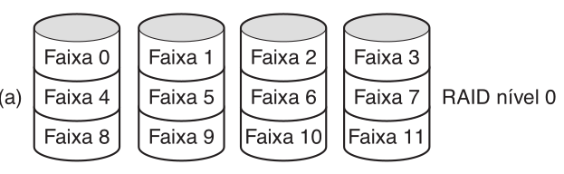

#+latex: \vfill\pause

** Desempenho

- N discos: taxa de transferência N \times maior
  para acessos de múltiplos blocos
- Sem ganho para acessos de um setor por vez

#+latex: \vfill\pause

** Limitação crítica

- Nenhuma redundância — não é RAID verdadeiro
- Falha de um disco destrói todos os dados do array
- MTBF do array é N vezes menor que o de um disco

* RAID 1 — Espelhamento

Técnica: duplicação completa de todos os discos

- Cada faixa gravada nos dois discos do par (espelhamento)
- Volume espelhado: disco lógico com dois discos físicos
- Sem distribuição — tudo é duplicado

#+attr_latex: :width .9\linewidth
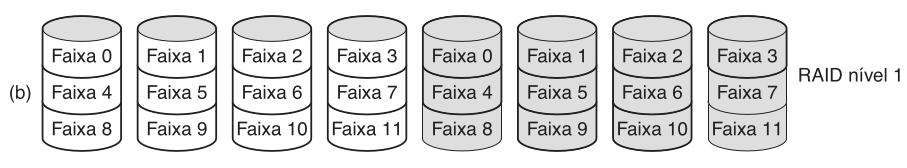

#+latex: \vfill

** Desempenho

- Leitura: qualquer cópia pode ser usada — dobra o throughput
- Escrita: sem melhora — ambos os discos recebem os dados

#+latex: \vfill

** Confiabilidade

- Falha de um disco: a cópia do par continua funcionando
- Recuperação: instalar novo disco e copiar dados do espelho
- MTBF de perda de dados \approx 57.000 anos @@latex:\linebreak@@
  (MTBF=100.000 h, tempo de reparo=10 h)

* RAID 2 — Código de Hamming com Sincronização

Técnica: striping em nível de palavra/byte com código Hamming

- Cada palavra de dados dividida bit a bit entre os discos
- Bits de paridade Hamming em discos adicionais (não representados)
  - Correção de erro de 1 bit sem parar o sistema

#+attr_latex: :width .9\linewidth
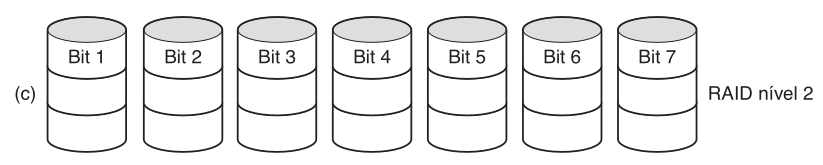

#+latex: \vfill

Requisitos e limitações:

- Discos rigorosamente sincronizados (rotação e braço)
- Sobrecarga: 19% com 32 discos de dados + 6 de paridade
- Controlador complexo: verificação Hamming em cada bit
- Uso: sistemas de alto desempenho (ex.: CM-2 da Thinking Machines)

#+latex: \vfill

Raramente utilizado na prática devido à complexidade

* RAID 3 — Paridade Simples com Sincronização

Técnica: versão simplificada do RAID 2

- Um único bit de paridade por palavra de dados
- Paridade gravada em disco dedicado
- Discos sincronizados: palavras espalhadas por múltiplos discos

#+attr_latex: :width .9\linewidth
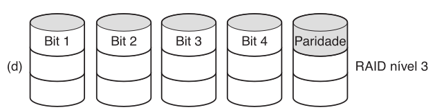

#+latex: \vfill\pause

** Correção de erro na falha de disco

- Posição do bit defeituoso é conhecida (disco quebrado)
- Controlador trata bits do disco falho como 0
- Erro de paridade indica que o bit deveria ser 1 — corrigido

#+latex: \vfill\pause

** Limitação: número de operações E/S por segundo não melhora
- Taxa de dados alta, mas não paraleliza requisições

* RAID 4 — Paridade Distribuída (1/2)

#+begin_center
[Como o RAID 0 + paridade faixa por faixa em disco extra]

#+attr_latex: :width .3\linewidth

#+end_center

RAID 4 — paridade por blocos intercalados em disco dedicado

- N discos de dados + 1 disco de paridade (XOR das faixas)
- Leitura de um bloco: acessa apenas um disco de dados
- Pequenas escritas: ciclo leitura-modificação-gravação
  (4 acessos ao disco por escrita)
- Problema: disco de paridade único torna-se gargalo

#+attr_latex: :width .9\linewidth
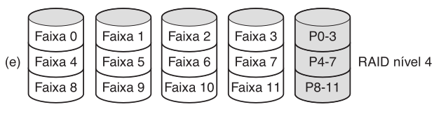

* RAID 5 — Paridade Distribuída (2/2)

RAID 5 — paridade distribuída com blocos intercalados

- Dados e paridade distribuídos por todos os N+1 discos
- Paridade do bloco n: disco (n mod N) + 1
- Elimina o gargalo do disco de paridade único
- Nível RAID com paridade mais utilizado na prática

#+attr_latex: :width .9\linewidth
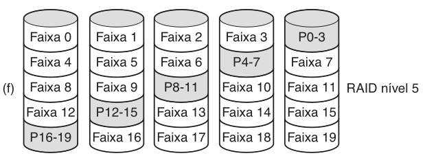

* RAID 6 — Redundância da Paridade Distribuída

RAID 6 — esquema de redundância P + Q (ou P + P' como na figura)

- Dois blocos de paridade (ex.: códigos Reed-Solomon)
- Tolera falha simultânea de até dois discos
- Escritas mais custosas; leituras sem penalidade adicional

#+attr_latex: :width .9\linewidth
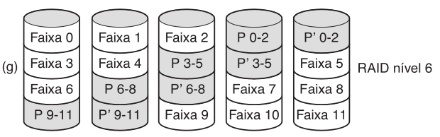

* Comparação dos Níveis
** Níveis e características                                        :BMCOL:

| Nível  | Redundância    | Overhead |
|--------+----------------+----------|
| RAID 0 | nenhuma        | 0%       |
| RAID 1 | espelhamento   | 100%     |
| RAID 4 | paridade única | 1/N      |
| RAID 5 | paridade dist. | 1/N      |
| RAID 6 | 2 paridades    | 2/N      |

** Uso típico

- RAID 0: alto desempenho, dados não críticos
- RAID 1: alta disponibilidade, recuperação rápida
- RAID 5: volumes grande, custo/desempenho equilibrado
- RAID 6: máxima confiabilidade

#+latex: \vfill

** Outro uso: desempenho e confiabilidade igualmente importantes
- Exemplo: bancos de dados pequenos

* RAID 0+1 e 1+0 — Níveis Combinados

RAID 0+1 — striping depois espelhamento

- Primeiro: criar distribuição (striping) dos dados
- Depois: espelhar toda a distribuição
- Falha de um disco: distribuição inteira fica inacessível

#+attr_latex: :width .35\linewidth
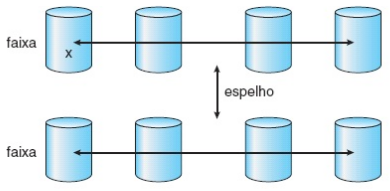

#+latex: \vfill

RAID 1+0 (/RAID 10/) — espelhamento depois striping

- Primeiro: espelhar discos em pares
- Depois: distribuir os pares espelhados
- Falha de um disco: apenas ele fica indisponível
- Disco espelhado continua disponível

#+attr_latex: :width .35\linewidth
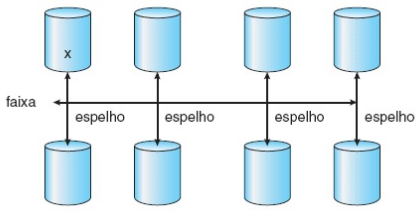

#+begin_center
Melhor desempenho que RAID 5, mas overhead de 100%
#+end_center

* Journaling: Motivação e Conceito

Operação simples (remover arquivo) envolve múltiplos passos:

1. Remover a entrada do diretório
2. Liberar o i-node para o conjunto de i-nodes livres
3. Devolver os blocos de dados para a lista de blocos livres

#+latex: \vfill\pause

** Queda do sistema no meio da operação gera inconsistência

- I-node e blocos ficam inacessíveis e não realocáveis
- Verificador (fsck/sfc) pode levar minutos ou horas
- Sistemas de terabytes: horas de verificação na inicialização

#+latex: \vfill\pause

** Solução: sistemas de arquivos journaling

- Registrar operações no diário antes de executá-las
- Ao reiniciar: retomar ou desfazer operações pendentes
- Exemplos: NTFS, ext3, ext4, ReiserFS, HFS+

* Journaling: Operação e Recuperação

Funcionamento do diário (/write-ahead log/):

1. Gravar entrada no diário com as ações a executar
2. Confirmar a gravação no diário (flush para disco)
3. Executar as operações nas estruturas reais do SF
4. Remover a transação do diário ao concluir

#+latex: \vfill\pause

** Recuperação após queda

- Transações confirmadas mas incompletas: reexecutar
- Transações não confirmadas: descartar (rollback)
- Operações devem ser idempotentes — podem ser repetidas

#+latex: \vfill\pause

** Benefício adicional: desempenho

- Escritas síncronas randômicas → escritas sequenciais no log
- Log: buffer circular em seção separada do sistema de arquivos

* Sistema de Arquivos Virtual (VFS)

Múltiplos sistemas de arquivos coexistem no mesmo computador

- ext4, NTFS, FAT32, NFS, ISO 9660 — todos ao mesmo tempo
- Windows: cada SF identificado por letra de unidade (C:, D:...)
- UNIX: hierarquia única integrada pelo VFS

#+latex: \vfill\pause

** VFS — /Virtual File System/ (Sun Microsystems, 1986)

- Abstrai a parte comum a todos os sistemas de arquivos
- Interface superior (POSIX): open, read, write, lseek, ...
- Interface inferior (VFS): funções implementadas por cada SF

#+attr_latex: :width .6\linewidth
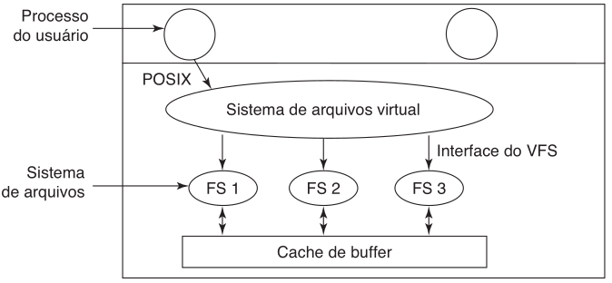

#+latex: \vfill

** Objetos: Superbloco, V-node (/i-node/), Tabelas

* Eficiência e Desempenho do Sistema de Arquivos
** Fatores que afetam a eficiência

- Tamanho dos ponteiros (32 ou 64 bits) limita tamanho máximo
- Data de último acesso: leitura exige gravação no diretório
- Pré-alocação de i-nodes melhora localidade no disco

#+latex: \vfill\pause

** Melhorias de desempenho

- Cache no controlador: trilha inteira lida de uma vez
- Escrita assíncrona: dados no cache; disco atualizado depois
- Escrita síncrona: necessária para transações atômicas (BD)

#+latex: \vfill

** Otimizações para acesso sequencial

- read-ahead: ler página solicitada e páginas seguintes
- free-behind: liberar página anterior ao avançar na leitura

* Cache de Buffer e Cache de Páginas
** Cache de buffer (em RAM não usada por processos)
- Mantém blocos de disco supondo reutilização iminente
- Gerenciado pelo SF; acesso por endereço físico de bloco
** Cache de páginas (em RAM não usada por processos)
- Armazena dados de arquivos como páginas (memória virtual)
- Acesso por endereço virtual — mais eficiente que por bloco
- Linux, Solaris, Windows: cache de páginas unificado
** Left                                                              :BMCOL:
:PROPERTIES:
:BEAMER_col: 0.35
:END:

#+attr_latex: :width .95\linewidth
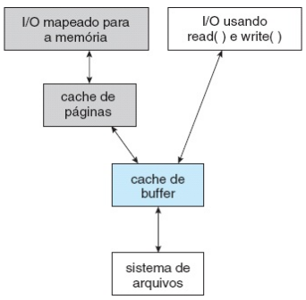
** Right                                                             :BMCOL:
:PROPERTIES:
:BEAMER_col: 0.60
:END:

Cache duplo (de buffer e de páginas)
- read()/write() passam pelo cache de buffer
- mmap() usa o os dois caches
Comportamento ruim
- Dados do FS são replicados
- Inconsistências entre os dois caches

* Integração com cache unificado

Cache unificado (somente de páginas)
- read()/write()
- mmap()

#+attr_latex: :width .55\linewidth
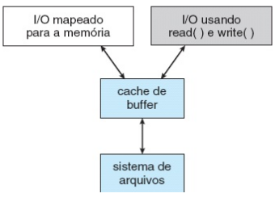

* Verificação de Consistência e Recuperação

** Queda do sistema pode deixar estruturas do SF inconsistentes

- Diretórios, ponteiros de blocos podem ser corrompidos
- FCB (File Control Block / i-node): metadados do arquivo
  - Proprietário, permissões, localização dos blocos de dados
- Cache de gravação não descarregado antes da queda do sistema

#+latex: \vfill\pause

** Verificador de consistência (fsck / sfc)

- Constrói dois contadores por bloco (em arquivo / na lista livre)
- Bloco desaparecido: não está em arquivo nem na lista livre
  → adicionar à lista de blocos livres
- Bloco duplicado na lista livre → reconstruir lista
- Bloco em dois arquivos → copiar e corrigir referências

#+latex: \vfill

** Verificação de diretórios

- Contagens de ligações nos i-nodes devem bater com entradas
- Contagem alta demais: desperdiça espaço (não crítico)
- Contagem baixa demais: i-node removido prematuramente

* Referências

- Silberchatz
  - Cap. 10, Sec. 10.7 — RAID
  - Cap. 12, Sec. 12.5 — Gerenciamento do espaço livre
  - Cap. 12, Sec. 12.6 — Eficiência e desempenho
  - Cap. 12, Sec. 12.7 — Recuperação
- Tanenbaum
  - Cap. 4, Secs. 4.3.5–4.3.7 — Journaling e VFS
  - Cap. 4, Secs. 4.4.2–4.4.3 — Backups e consistência
  - Cap. 5, Sec. 5.4.2 — RAID (níveis 0–6)
