# -*- coding: utf-8 -*-
# -*- mode: org -*-
#+startup: beamer overview indent
#+LANGUAGE: pt-br
#+TAGS: noexport(n)
#+EXPORT_EXCLUDE_TAGS: noexport
#+EXPORT_SELECT_TAGS: export

#+Title: Gerência de Entrada e Saída
#+Author: Prof. Lucas Mello Schnorr
#+Date: \copyleft

#+LaTeX_CLASS: beamer
#+LaTeX_CLASS_OPTIONS: [xcolor=dvipsnames,10pt]
#+OPTIONS: H:1 num:t toc:nil \n:nil @:t ::t |:t ^:t -:t f:t *:t <:t
#+LATEX_HEADER: \input{org-babel.tex}

* Estrutura

- Visão Geral de E/S
  - Dispositivos de E/S: Tipos e Velocidades
  - Controladores de Dispositivo e Registradores
- Hardware de E/S
  - Polling
  - Interrupções
  - Acesso Direto à Memória (DMA)
  - Comparação: E/S Programada, por Interrupção e DMA
- Interface de E/S da aplicação
  - Camadas do Software de E/S
  - Tratadores de Interrupção
  - Drivers de Dispositivo
  - Software Independente de Dispositivo
- Subsistema de E/S do kernel
  - Buffering, Caching e Spooling
  - E/S Bloqueante e Não-Bloqueante

* -- Visão Geral de E/S

- Dispositivos de E/S conectados ao computador por portas e barramentos
- Controlador: comp. eletrônico que opera a porta, o bus ou o dispositivo
- Driver de dispositivo: módulo de software que contém detalhes do hardware
- Subsistema de E/S do kernel: interface uniforme para os drivers

#+attr_latex: :width .7\linewidth
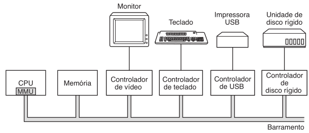

#+latex: \vfill

** Objetivos do subsistema de E/S
- Ocultar detalhes de hardware do restante do SO
- Abstrair diversidade de dispositivos em interface comum
- Controlar operações, tratar erros e gerenciar recursos de E/S

* Dispositivos de E/S: Tipos e Velocidades

** Dispositivos de bloco
- Armazenam dados em blocos de tamanho fixo, cada um com endereço
- Leitura e escrita independentes por bloco
- Exemplos: disco rígido, SSD, pendrive

** Dispositivos de caractere
- Entregam ou aceitam fluxo de caracteres
- Sem estrutura de bloco endereçável
- Exemplos: teclado, mouse, impressora, placa de rede serial

#+latex: \vfill

** Velocidades típicas de E/S

| Dispositivo       | Velocidade típica |
|-------------------+-------------------|
| Teclado           | \approx 10 B/s    |
| Rede Gigabit      | \approx 125 MB/s  |
| Disco NVMe        | \approx 3,5 GB/s  |
| Barramento PCIe   | \approx 16 GB/s   |

* Controladores de Dispositivo e Registradores

- Controlador: interface eletrônica entre CPU e dispositivo físico
- CPU comunica-se com o controlador, não diretamente com o dispositivo
- Cada controlador possui registradores de porta de E/S

#+latex: \vfill

** Quatro registradores de porta de E/S
- Registrador de dados de entrada: lido pela CPU para obter dados
- Registrador de dados de saída: escrito pela CPU para enviar dados
- Registrador de status: indica estado (ocupado, erro, pronto)
- Registrador de controle: recebe comandos da CPU

#+latex: \vfill

** E/S mapeada em memória vs. por porta
- Mapeada em memória: registradores mapeados no espaço de endereços;
  acesso via instruções comuns de leitura/escrita
- Por porta: registradores em espaço de endereços separado;
  requer instruções especiais (IN/OUT)

* -- Hardware de E/S

Mecanismos de interação com o hardware de E/S
- E/S Programada (ou Polling)
- Interrupções
- Acesso Direto à Memória (DMA)
# - Comparação: E/S Programada, por Interrupção e DMA

* E/S Programada / Polling (espera ocupada)

1. Ler registrador de status
2. Verificar bit busy
3. Se busy=1, voltar ao passo 1
4. Escrever dado no registrador de saída
5. Setar bit command-ready
6. Aguardar controlador concluir

** Exemplo da impressão de uma sequência

#+attr_latex: :width .7\linewidth
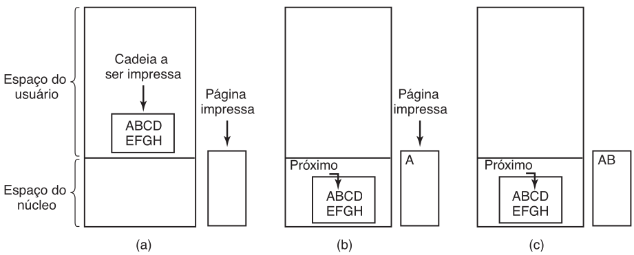

** Desvantagem: CPU fica em loop, desperdiçando ciclos

* Interrupções

** Operações                                                         :BMCOL:
:PROPERTIES:
:BEAMER_col: 0.4
:END:
1. CPU inicia operação no dispositivo
2. CPU continua executando outro processo
3. Controlador conclui a operação
4. Controlador levanta sinal de interrupção
5. CPU detecta a interrupção
6. CPU salva estado e desvia para
   tratador de interrupção
7. Tratador executa e retorna

** Imagem                                                            :BMCOL:
:PROPERTIES:
:BEAMER_col: 0.6
:END:

#+attr_latex: :width \linewidth
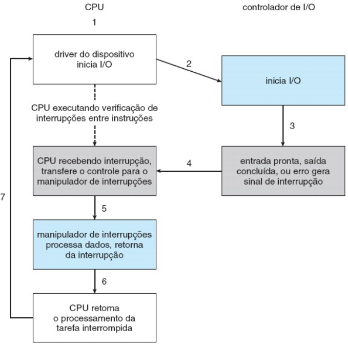

** Vantagem: CPU faz trabalho útil enquanto aguarda        :B_ignoreheading:
:PROPERTIES:
:BEAMER_env: ignoreheading
:END:

* Acesso Direto à Memória (DMA)

- DMA elimina a necessidade da CPU transferir dados byte a byte
- Controlador DMA acessa o barramento de memória diretamente
- Roubo de ciclo: DMA usa o barramento enquanto a CPU não precisa dele

#+latex: \vfill

** Left                                                              :BMCOL:
:PROPERTIES:
:BEAMER_col: 0.6
:END:
#+attr_latex: :width \linewidth
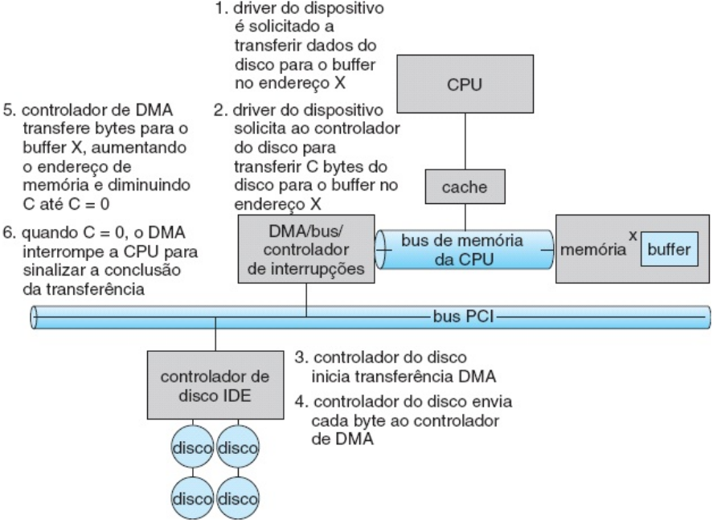

** Fluxo de transferência DMA (7 etapas)                             :BMCOL:
:PROPERTIES:
:BEAMER_col: 0.4
:END:

#+latex: {\scriptsize
1. CPU programa o controlador DMA: endereço, destino, contagem, direção
2. CPU emite comando ao dispositivo para iniciar transferência
3. Controlador DMA solicita acesso ao barramento
4. Controlador DMA transfere um bloco de dados para a memória principal
5. Controlador DMA incrementa endereço e decrementa contador de bytes
6. Etapas 3–5 repetidas até contador chegar a zero
7. Controlador DMA interrompe a CPU: transferência concluída
#+latex: }
   
* Comparação: E/S Programada, por Interrupção e DMA

| Aspecto             | E/S Programada | Por Interrupção | DMA             |
|                     | Polling        |                 |                 |
|---------------------+----------------+-----------------+-----------------|
| Envolvimento da CPU | Contínuo       | Por interrupção | Só início e fim |
| Transferência       | Byte a byte    | Byte a byte     | Bloco completo  |
| Ocupação da CPU     | Alta (espera)  | Média           | Baixa           |
| Uso adequado        | Dispositivos   | Dispositivos de | Discos e redes  |
|                     | muito lentos   | baixa vazão     | (alta vazão)    |

#+latex: \pause

** Lidando com a diversidade de dispositivos

- Grande variedade de dispositivos: cada um tem recursos, bits de
  controle e protocolos próprios e distintos
- Desafio duplo: permitir novos dispositivos sem reescrever o SO e
  oferecer interface de I/O uniforme às aplicações

* -- Camadas do Software de E/S

- Software de E/S organizado em camadas com interfaces bem definidas
- Cada camada tem responsabilidades específicas

#+attr_latex: :width .8\linewidth
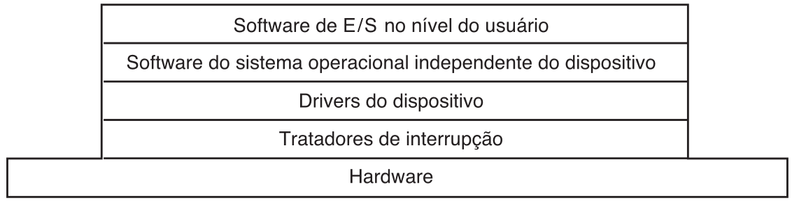

# 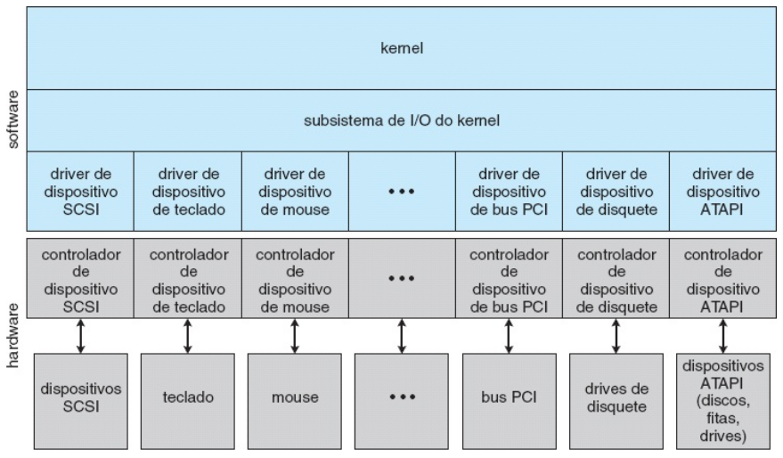

#+latex: \vfill

** Da camada mais alta à mais baixa
#+latex: {\small
- Processos do usuário: chamadas de E/S, formatação, spooling
- Software independente de dispositivo: nomeação, proteção,
  buffering, alocação de dispositivos, tamanho de bloco uniforme
- Drivers de dispositivo: ajuste de registradores do controlador,
  verificação de estado do dispositivo
- Tratadores de interrupção: acordam o driver quando E/S completa
- Hardware: executa a operação de E/S física
#+latex: }

* Exemplo das camadas do Software até o hardware de E/S

#+attr_latex: :width \linewidth

* Tratadores de Interrupção                                        :noexport:

Quando ocorre uma interrupção, o tratador executa as seguintes etapas:

#+latex: \vfill

1. Salvar registradores não salvos automaticamente pelo hardware
2. Estabelecer contexto para a rotina de serviço (TLB, MMU, tabela de páginas)
3. Estabelecer pilha para a rotina de serviço de interrupção
4. Sinalizar controlador de interrupções; reabilitar interrupções
5. Copiar registradores do processo interrompido para sua tabela de processos
6. Executar a rotina de serviço (ler e armazenar dados do controlador)
7. Escolher qual processo executar a seguir (escalonamento)
8. Carregar contexto de MMU para o próximo processo
9. Carregar registradores do próximo processo (incluindo PSW)
10. Iniciar execução do próximo processo

* Drivers de Dispositivo 1/2

- Driver: módulo de software específico para um controlador de dispositivo
- Posicionado entre o software independente de dispositivo e o hardware
- Cada tipo de dispositivo exige um driver diferente

#+latex: \vfill\pause

** Responsabilidades do driver

- Aceitar solicitações abstratas da camada acima
- Traduzir solicitação em comandos para os registradores do controlador
- Iniciar a operação e aguardar interrupção de conclusão
- Verificar erros reportados pelo controlador
- Retornar dados ou status para a camada superior

#+latex: \vfill

* Drivers de Dispositivo 2/2

** Estrutura padrão

- SO define interface padrão para drivers de bloco e de caractere
- Fabricantes implementam drivers para cada SO suportado
- Drivers geralmente executam em modo kernel (privilegiado)

#+attr_latex: :width .8\linewidth
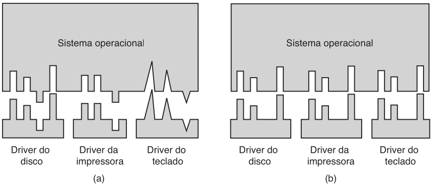

* Software Independente de Dispositivo
- Camada entre os drivers e o software do espaço do usuário
- Executa funções comuns a todos os dispositivos

#+attr_latex: :width .65\linewidth
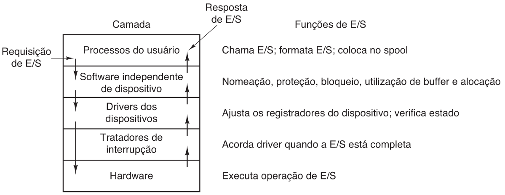

#+latex: \vfill

** Cinco funções principais
#+latex: {\small
1. Fornecer interface uniforme para drivers de dispositivos
   - Nomeação, proteção, abertura/fechamento de dispositivos
2. _Buffering_: armazenar dados temporariamente durante transferências
3. Reportar erros ao processo ou ao usuário
4. Alocar e liberar dispositivos dedicados
   - Evitar uso simultâneo por múltiplos processos
5. Fornecer tamanho de bloco independente de dispositivo
   - Ocultar diferenças de tamanho de setor entre dispositivos
#+latex: }
     
* Buffering
- Área de memória para dados em trânsito entre entidades
  - Várias estratégias
# - Buffer simples: um buffer no kernel
# - Buffer duplo: produtor e consumidor alternam entre dois buffers

#+attr_latex: :width .6\linewidth
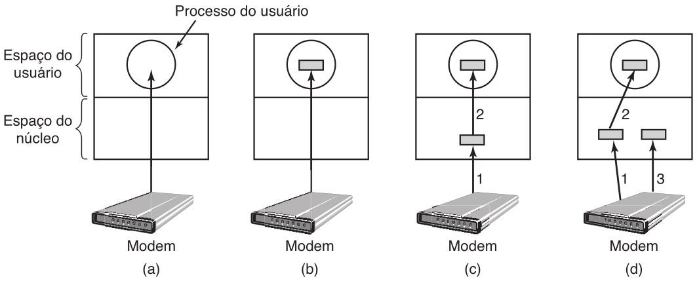

#+latex: \pause

** Buffering pode ser excessivo (múltiplas cópias)

#+attr_latex: :width .6\linewidth
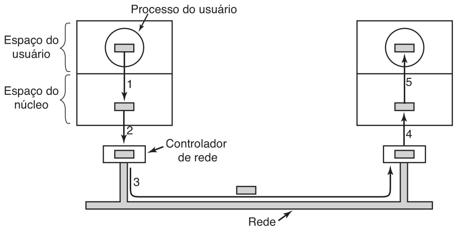

* Spooling (Simultaneous Peripheral Operations On-Line)            :noexport:
- Buffer para dispositivos que não aceitam fluxos intercalados
- Exemplo clássico: impressora
- Processos escrevem no spool; daemon lê e envia ao dispositivo
- Evita intercalação de saídas de múltiplos processos

* Dispositivos de Blocos e de Caracteres

** Tipos
- Dispositivos de bloco -- transferem dados em blocos
  - Suportam =read()=, =write()= e =seek()= \to acesso aleatório
  - (discos)
- Dispositivos de caractere -- transferem bytes um a um
  - Suportam =get()= e =put()= \to acesso sequencial
  - (teclado, mouse, impressora)

#+latex: \pause

** Características

- I/O bruto (/raw I/O/): acesso direto ao dispositivo
  - Como array linear de blocos, sem sistema de arquivos
- I/O direto (/direct I/O/): desabilita buffering e travamento do SO
  - Útil para SGBDs que gerenciam seu próprio buffer
- Arquivos mapeados em memória
  - Acesso a disco via array de bytes na RAM
  - Transferências via mecanismo de paginação por demanda

* Dispositivos de Rede

#+latex: \vfill

- I/O de rede difere do de disco: endereçamento e desempenho distintos
- Interface padrão: sockets de rede (UNIX, Windows)
- Operações básicas: criar socket, conectar, escutar, enviar, receber

#+latex: \vfill\pause

** =select()=

- Gerencia um conjunto de sockets em uma única chamada
- Retorna quais sockets têm pacotes prontos
  - Para receber ou espaço para enviar
- Elimina sondagem e espera ativa para I/O de rede

** Disciplina de Redes \to Programação com sockets

#+attr_latex: :width .5\linewidth
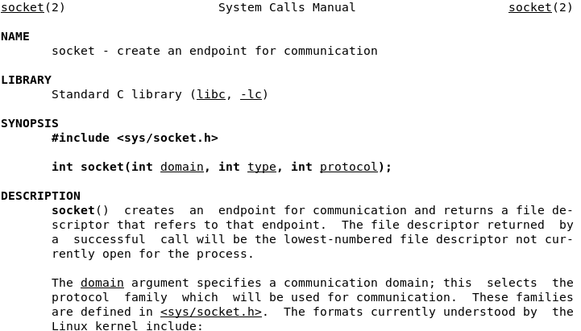

* Dispositivos de relógios e temporizadores

#+latex: \vfill

Três funções básicas fornecidas pelo hardware:

- Informar a hora corrente
- Informar o tempo decorrido
- Configurar um timer para disparar a operação X no tempo T

#+latex: \vfill\pause

** Timer de intervalo programável

- Gera interrupção após período configurado — uma vez ou periodicamente
- Usos: preempção de processos, descarga de buffers de cache, timeout
  de operações de rede
- Resolução típica: 18–60 tiques/segundo — baixa para CPUs modernas
- Solução: kernel simula relógios virtuais com lista de interrupções
  ordenada temporalmente

#+latex: \vfill

* 13.3.5 I/O Vetorizado                                            :noexport:

#+latex: \vfill

- Também chamado /scatter-gather/: uma única chamada de sistema executa
  múltiplas operações em múltiplos buffers
- UNIX: =readv()= / =writev()= — lê de uma origem para vetor de buffers
  (espalhar) ou grava de vetor de buffers para destino (reunir)

#+latex: \vfill\pause

** Vantagens sobre múltiplas chamadas individuais

- Reduz overhead de trocas de contexto e chamadas de sistema
- Elimina cópia intermediária para buffer único antes da transmissão
- Algumas implementações garantem atomicidade — evita corrupção se
  múltiplos threads executam I/O nos mesmos buffers simultaneamente

#+latex: \vfill

* Modos de funcionamento
** E/S Bloqueante
- Chamada suspende o processo até que a E/S seja concluída
- Processo vai para fila de espera \to CPU escalona outro processo
- Interface simples para o programador
- Exemplo: =read()= sem flags
** E/S Não-Bloqueante
- Retorna imediatamente com dados disponíveis (pode ser 0)
- Processo continua executando
- Exemplo: read() com =O_NONBLOCK= \to open()
** Assíncrona
- Retorna imediatamente
- E/S prossegue em segundo plano
- Notifica via sinal ou callback ao concluir
- Maior complexidade para o programador

* Referências

- Silberschatz, Galvin, Gagne. Fundamentos de Sistemas Operacionais,
  9ª edição. LTC Editora, 2015.
  - Capítulo 13: Subsistemas de E/S
  - Seção 13.1: Visão geral de E/S
  - Seção 13.2: Hardware de E/S
  - Seção 13.3: Interface de E/S do kernel de aplicativo

#+latex: \vfill

- Tanenbaum, Bos. Sistemas Operacionais Modernos. Pearson.
  - Capítulo 5: Entrada/Saída
  - Seção 5.1: Princípios do hardware de E/S
  - Seção 5.2: Princípios do software de E/S
  - Seção 5.3: Camadas do software de E/S
